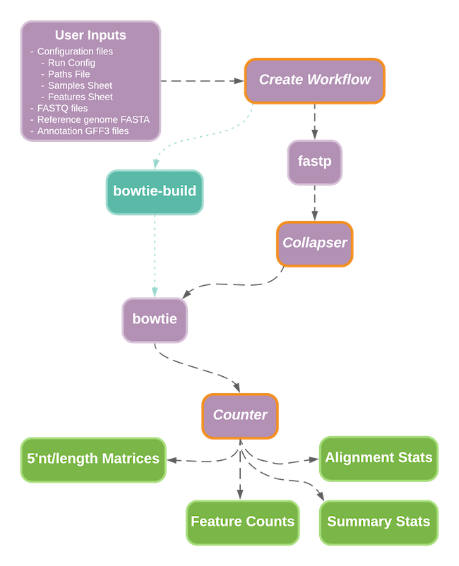
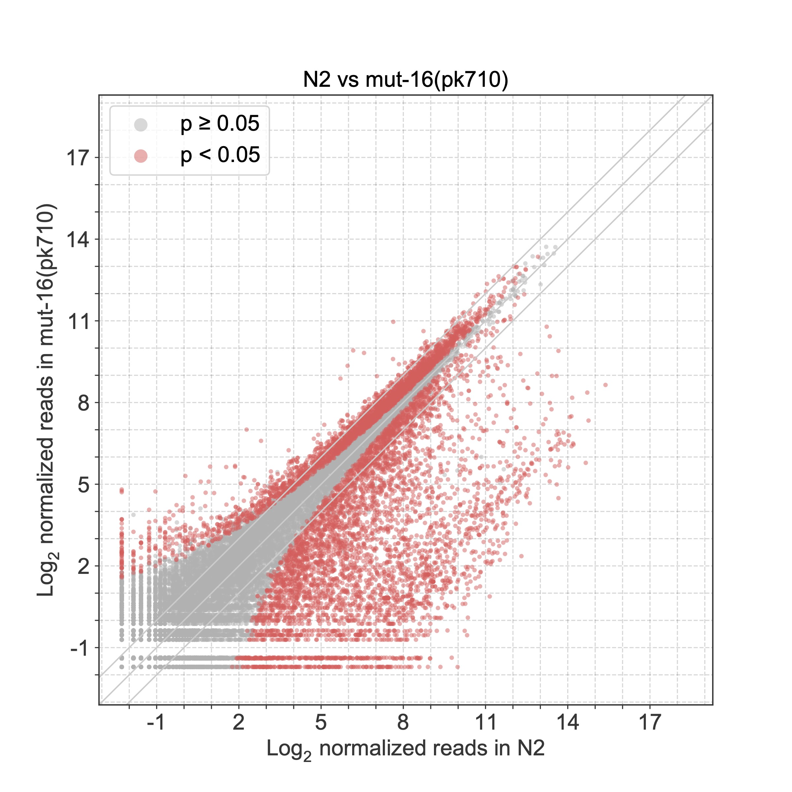
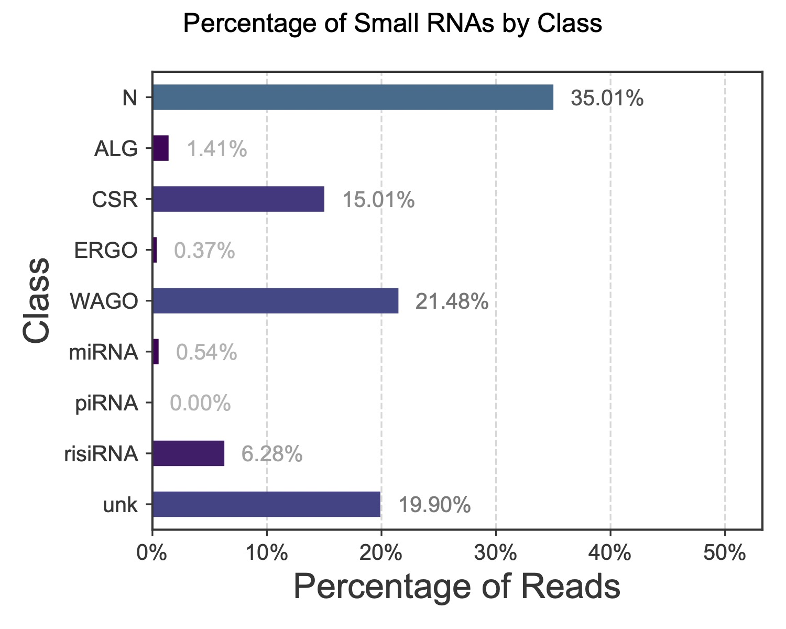
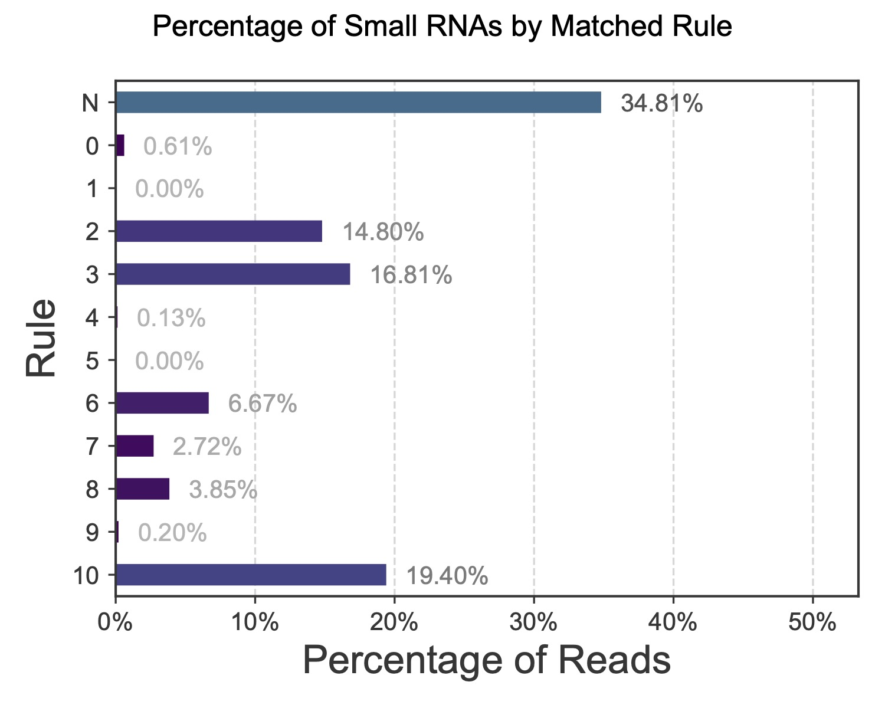
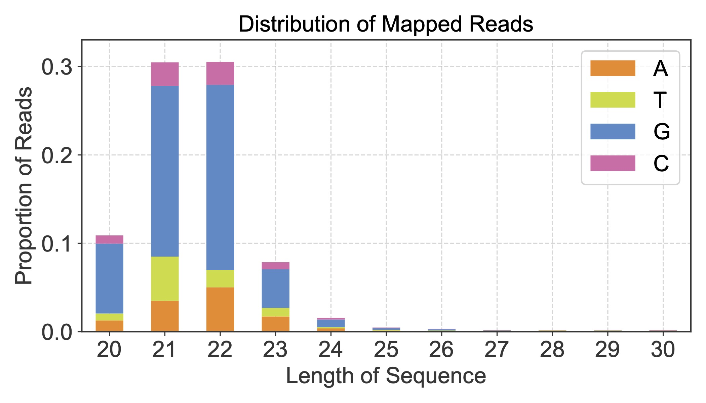
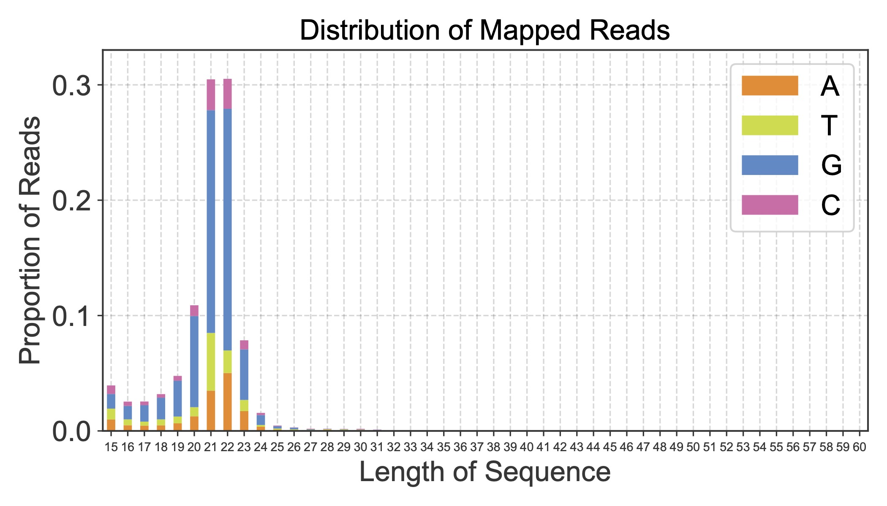

# tinyRNA: precision analysis of small RNA high-throughput sequencing data
:warning: **Under Development & Testing** :warning:

*This repository is being actively developed and tested, and is thus incomplete and only recommended for testing until a release is made. Feedback, suggestions, and bug reports are welcome under the [issues tab](https://github.com/MontgomeryLab/tinyrna/issues). Thank you!*

- [Installation](#installation)
- [Usage](#usage)
  - [Configuration Files](#configuration-files)
  - [User-Provided Input Files](#requirements-for-user-provided-input-files)
  - [Running the End-to-End Analysis](#running-an-end-to-end-analysis)
  - [Resuming an End-to-End Analysis](#resuming-an-end-to-end-analysis)
  - [Running Individual Steps](#running-individual-steps)
- [Outputs](#outputs)
  - [Data Pre-Processing](#data-pre-processing)
  - [Collapsed FASTA files](#collapsed-fasta-files)
  - [Counts and Pipeline Statistics](#counts-and-pipeline-statistics)
  - [Differential Expression Analysis](#differential-expression-analysis)
  - [Plots](#plots)
- [Contributing](#contributing)
- [Authors](#authors)
- [License](#license)


tinyRNA is a set of tools to simplify the analysis of next-generation sequencing data. The goal of this specific repository is to provide an entire workflow for processing small RNA sequencing data with options for advanced hierarchical feature selection.

### The Current Workflow



## Installation

A setup script has been provided for easy installation of tinyRNA. The project and its dependencies will be installed in a conda environment named `tinyrna` after running the following commands in your terminal:

```shell
# Clone the repository into a local directory
 git clone https://github.com/MontgomeryLab/tinyrna.git
 cd tinyrna

# Install the tinyrna environment and dependencies
 ./setup.sh
```

If the installation script runs the Miniconda installer:
- Press "q" if you find yourself trapped on the license page
- We recommend answering "yes" to running `conda init`

## Usage

The `tinyrna` conda environment must be activated before use.
```shell
# Activate the tinyrna environment
 conda activate tinyrna
 
## (your commands here: tiny run, tiny-count, etc.)

# When you are done running tinyRNA, you can deactivate the conda environment
 conda deactivate
```
If you'd like to jump right in and start using tinyRNA, see our [tutorial](START_HERE/TUTORIAL.md).

You can execute the workflow in its entirety for a full end-to-end analysis pipeline, or you can execute individual steps on their own. In most cases you will use the command `tiny` for pipeline operations.

### Configuration Files
The pipeline requires that you identify:
- Your preferences for the pipeline and its steps via the **Run Config**
- The location of your config files and other file inputs via the **Paths File**
- Your selection preferences for feature counting via the **Features Sheet**
- Your samples via the **Samples Sheet**


For more information, please see the [configuration file documentation](doc/Configuration.md). The `START_HERE` directory demonstrates a working configuration using these files. You can also get a copy of them by running the command:
```shell
tiny get-template
```


### Requirements for User-Provided Input Files

| Input Type                                                                                 | File Extension          | Requirements                                                                                                                                                                            |
|--------------------------------------------------------------------------------------------|-------------------------|-----------------------------------------------------------------------------------------------------------------------------------------------------------------------------------------|
| Reference annotations<br/>[(example)](START_HERE/reference_data/c_elegans_WS279_chr1.gff3) | GFF3 / GFF2 / GTF       | <ul><li>An attributes column (col. 9) which defines each feature's `ID`</li><li>Attribute values containing commas must represent lists</li><li>All features must be stranded</li></ul> |
| Sequencing data<br/>[(example)](START_HERE/fastq_files)                                    | FASTQ(.gz) <sup>1</sup> | Files must be demultiplexed.                                                                                                                                                            |
| Reference genome<br/>[(example)](START_HERE/reference_data/chr1.fa)                        | FASTA                   | Chromosome identifiers: <ul><li>Must match your reference annotation files</li><li>Are case sensitive</li></ul>                                                                         |
| Bowtie indexes (optional) <sup>2</sup>                                                     | ebwt                    | Must be small indexes (.ebwtl indexes are not supported)                                                                                                                                |

<br/><sup>1</sup> `tiny-count` accepts SAM files via your **Samples Sheet** when invoked as an individual step, but they must have been produced by the pipeline. SAM files from other sources are not currently supported. 
<br/><sup>2</sup> Bowtie indexes can be created for you. See the [Paths File documentation](doc/Configuration.md#building-bowtie-indexes).

### Running an End-to-End Analysis
In most cases you will use this toolset as an end-to-end pipeline. This will run a full, standard small RNA sequencing data analysis according to your configuration file. Before starting, you will need the following:

1. High-throughput sequencing data in fastq format. 
2. The genome sequence of interest in fasta format.
3. Genome coordinates of small RNA features of interest in GFF format.
4. A completed Samples Sheet (`samples.csv`) with paths to the fastq files.
5. A completed Features Sheet (`features.csv`) with paths to the GFF file(s).
6. An updated Paths File (`paths.yml`) with the path to the genome sequence and/or your bowtie index prefix.
7. A Run Config file (`run_config.yml`) located in your working directory or the path to the file. The template provided does not need to be updated if you wish to use the default settings.

To run an end-to-end analysis, be sure that you're working within the conda tinyrna environment ([instructions above](#usage)) in your terminal and optionally navigate to the location of your Run Config file. Then, simply run the following in your terminal:

```
tiny run --config run_config.yml
```

### Resuming an End-to-End Analysis

The Counter and Plotter steps offer a wide variety of options for refining your analysis. You might find that repeat analyses are required while tuning these options to your goals. To save time and skip redundant compute-heavy preprocessing steps, you can resume a prior analysis using its outputs from the early pipeline steps.

```shell
# Resume a prior analysis at the Counter step
tiny recount --config processed_run_config.yml

# Resume a prior analysis at the Plotter step
tiny replot --config processed_run_config.yml
```
For more information and prerequesites, see the [pipeline resume documentation](doc/Pipeline.md#resuming-a-prior-analysis).

### Running Individual Steps
The process for running individual steps differs depending on whether the step is a tinyRNA Python component (outlined in yellow in the [workflow diagram](#the-current-workflow)), or a CWL-wrapped third party tool.

The following steps are Python components which can be run from the command line within the tinyRNA conda environment:
##### Create Workflow
```
tiny-config -i CONFIG

  required arguments:
    -i CONFIG, --input-file CONFIG
                          The Run Config file to be processed
```
##### Collapser
```
tiny-collapse -i FASTQFILE -o OUTPREFIX [-h] [-t THRESHOLD] [-c]
              [--5p-trim LENGTH] [--3p-trim LENGTH]

Collapse sequences from a fastq file to a fasta file. Headers in the output
fasta file will contain the number of times each sequence occurred in the
input fastq file, and an ID which indicates the relative order in which each
sequence was first encountered. Gzipped files are automatically supported for
fastq inputs, and compressed fasta outputs are available by request.

Required arguments:
  -i FASTQFILE, --input-file FASTQFILE
                        The input fastq(.gz) file to collapse
  -o OUTPREFIX, --out-prefix OUTPREFIX
                        The prefix for output files {prefix}_collapsed.fa and,
                        if counts fall below threshold,
                        {prefix}_collapsed_lowcounts.fa

Optional arguments:
  -h, --help            show this help message and exit
  -t THRESHOLD, --threshold THRESHOLD
                        Sequences <= THRESHOLD will be omitted from
                        {prefix}_collapsed.fa and will instead be placed in
                        {prefix}_collapsed_lowcounts.fa
  -c, --compress        Use gzip compression when writing fasta outputs
  --5p-trim LENGTH      Trim LENGTH bases from the 5' end of each sequence
  --3p-trim LENGTH      Trim LENGTH bases from the 3' end of each sequence
```
##### Counter
[Full documentation for Counter can be found here](doc/Counter.md).

```
tiny-count -i SAMPLES -c CONFIGFILE -o OUTPUTPREFIX [-h]
           [-sf [SOURCE [SOURCE ...]]] [-tf [TYPE [TYPE ...]]]
           [-nh T/F] [-dc] [-a] [-p] [-d]

This submodule assigns feature counts for SAM alignments using a Feature Sheet
ruleset. If you find that you are sourcing all of your input files from a
prior run, we recommend that you instead run `tiny recount` within that run's
directory.

Required arguments:
  -i SAMPLES, --input-csv SAMPLES
                        your Samples Sheet
  -c CONFIGFILE, --config CONFIGFILE
                        your Features Sheet
  -o OUTPUTPREFIX, --out-prefix OUTPUTPREFIX
                        output prefix to use for file names

Optional arguments:
  -h, --help            show this help message and exit
  -sf [SOURCE [SOURCE ...]], --source-filter [SOURCE [SOURCE ...]]
                        Only produce counts for features whose GFF column 2
                        matches the source(s) listed
  -tf [TYPE [TYPE ...]], --type-filter [TYPE [TYPE ...]]
                        Only produce counts for features whose GFF column 3
                        matches the type(s) listed
  -nh T/F, --normalize-by-hits T/F
                        If T/true, normalize counts by (selected) overlapping
                        feature counts. Default: true.
  -dc, --decollapse     Create a decollapsed copy of all SAM files listed in
                        your Samples Sheet.
  -a, --all-features    Represent all features in output counts table, even if
                        they did not match a Select for / with value.
  -p, --is-pipeline     Indicates that counter was invoked as part of a
                        pipeline run and that input files should be sourced as
                        such.
  -d, --report-diags    Produce diagnostic information about
                        uncounted/eliminated selection elements.
```
##### Deseq2
```
tiny-deseq.r --input-file COUNTFILE --outfile-prefix PREFIX [--control CONDITION] [--pca] [--drop-zero]

Required arguments:

    --input-file <count_file>
          A text file containing a table of features x samples of the run to
          process by DESeq2. The [...]feature_counts.csv output of tinyrna-count is expected here.
              
    --outfile-prefix <outfile>
          Name of the output files to write. These will be created:
              1. Normalized count table of all samples
              2. Differential gene expression table per comparison
              3. A PCA plot per comparison, if --pca is also provided.

Optional arguments:

    --control <control_condition>
          Opional. If the control condition is specified, comparisons will
          only be made between the control and experimental conditions.

    --pca
          Optional. This will produce principle component analysis plots
          using the DESeq2 library. Output files are PDF format.

    --drop-zero
          Optional. Prior to performing analysis, this will drop all
          rows/features which have a zero count in all samples."
```
##### Plotter
[Full documentation for Plotter can be found here](doc/Plotter.md).

```
tiny-plot [-rc RAW_COUNTS] [-nc NORM_COUNTS] [-uc RULE_COUNTS]
          [-ss STAT] [-dge COMPARISON [COMPARISON ...]]
          [-len 5P_LEN [5P_LEN ...]] [-h] [-o PREFIX] [-pv VALUE]
          [-s MPLSTYLE] [-v] [-ldi VALUE] [-lda VALUE] -p PLOT
          [PLOT ...]

This script produces basic static plots for publication as part of the tinyRNA
workflow. Input file requirements vary by plot type and you are free to supply
only the files necessary for your plot selections. If you are sourcing all of
your input files from the same run directory, you may find it easier to
instead run `tiny replot` within that run directory.

Required arguments:
  -p PLOT [PLOT ...], --plots PLOT [PLOT ...]
                        List of plots to create. Options:
                        • len_dist: A stacked barchart showing size & 5'
                          nucleotide distribution.
                        • rule_charts: A barchart showing percentages
                          of counts by matched rule.
                        • class_charts: A barchart showing percentages
                          of counts per class.
                        • replicate_scatter: A scatter plot comparing
                          replicates for all count files given.
                        • sample_avg_scatter_by_dge: A scatter plot comparing
                          all sample groups, with differentially expressed
                          small RNAs highlighted based on P value cutoff.
                        • sample_avg_scatter_by_dge_class: A scatter plot
                          comparing all sample groups, with classes
                          highlighted for differentially expressed small RNAs
                          based on P value cutoff.

Input files produced by Counter:
  -rc RAW_COUNTS, --raw-counts RAW_COUNTS
                        The ...feature_counts.csv file
  -uc RULE_COUNTS, --rule-counts RULE_COUNTS
                        The ...counts-by-rule.csv file
  -ss STAT, --summary-stats STAT
                        The ...summary_stats.csv file
  -len 5P_LEN [5P_LEN ...], --len-dist 5P_LEN [5P_LEN ...]
                        The ...nt_len_dist.csv files

Input files produced by DGE:
  -nc NORM_COUNTS, --norm-counts NORM_COUNTS
                        The ...norm_counts.csv file
  -dge COMPARISON [COMPARISON ...], --dge-tables COMPARISON [COMPARISON ...]
                        The ...cond1...cond2...deseq.csv files

Optional arguments:
  -h, --help            show this help message and exit
  -o PREFIX, --out-prefix PREFIX
                        Prefix to use for output filenames.
  -pv VALUE, --p-value VALUE
                        P value to use in DGE scatter plots.
  -s MPLSTYLE, --style-sheet MPLSTYLE
                        Optional matplotlib style sheet to use for plots.
  -v, --vector-scatter  Produce scatter plots with vectorized points (slower).
                        Note: only the points on scatter plots will be raster
                        if this option is not provided.
  -ldi VALUE, --len-dist-min VALUE
                        len_dist plots will start at this value
  -lda VALUE, --len-dist-max VALUE
                        len_dist plots will end at this value
```

##### CWL-Wrapped Third Party Tools.
fastp, bowtie-build, and bowtie can be run from the terminal (within the tinyRNA conda environment) just as you would if they were installed in the host environment. Commandline arguments for these tools can be lengthy, but with a little setup you can make things easier for yourself by using our CWL wrappers and a configuration file for each tool. This allows you to more easily set commandline parameters from a text editor and reuse configuration files. See the [pipeline documentation](doc/Pipeline.md#cwl-wrapped-third-party-tools) for details.

## Outputs

The files produced by each pipeline step will be included in the final run directory by default. These intermediate files are organized into subdirectories by step.

### Data Pre-Processing

[fastp](https://github.com/OpenGene/fastp) is used to trim adapters and remove poor quality reads from FASTQ input files. Summary and quality statistics reports are generated for each library. These reports are used to calculate the pipeline summary statistics for total reads and retained reads.

### Collapsed FASTA files
A "collapsed" FASTA contains unique reads found in fastp's quality filtered FASTQ files. Each header indicates the number of times that sequence occurred in the input. This allows for faster bowtie alignments while preserving counts for downstream analysis.

### Counts and Pipeline Statistics
The counter step produces a variety of outputs

#### Feature Counts
Custom Python scripts and HTSeq are used to generate a single table of feature counts that includes columns for each library analyzed. A feature's _Feature ID_ and _Feature Class_ are simply the values of its `ID` and `Class` attributes. Features lacking a Class attribute will be assigned class `_UNKNOWN_`. We have also included a _Feature Name_ column which displays aliases of your choice, as specified in the _Alias by..._ column of the Features Sheet. If _Alias by..._ is set to`ID`, the _Feature Name_ column is left empty.

For example, if your Features Sheet has a rule which specifies _Alias by..._ `sequence_name` and the GFF entry for this feature has the following attributes column:
```
... ID=406904;sequence_name=mir-1,hsa-miR-1;Class=miRNA; ...
```
The row for this feature in the feature counts table would read:

| Feature ID | Feature Name     | Feature Class | Group1_rep_1 | Group1_rep_2 | ... |
|------------|------------------|---------------|--------------|--------------|-----|
| 406904     | mir-1, hsa-miR-1 | miRNA         | 1234         | 999          | ... |

#### Normalized Counts
If your Samples Sheet has settings for Normalization, an additional copy of the Feature Counts table is produced with the specified per-library normalizations applied.

#### Counts by Rule
This table shows the counts assigned by each rule on a per-library basis. It is indexed by the rule's corresponding row number in the Features Sheet, where the first non-header row is considered row 0. For convenience a Rule String column is added which contains a human friendly concatenation of each rule. Finally, a Mapped Reads row is added which represents each library's total read counts which were available for assignment prior to counting/selection.

#### Alignment Statistics
A single table of alignment statistics includes columns for each library and the following stats:

| Stat                                                 | Description                                                                                                         |
|------------------------------------------------------|---------------------------------------------------------------------------------------------------------------------|
| Total Assigned Reads                                 | Counts from sequences that aligned to at least one feature in your Features Sheet                                   |
| Total Unassigned Reads                               | Total counts for sequences that didn't align to any features in your Features Sheet                                 |
| Total Assigned Sequences                             | Unique sequences that aligned to at least one feature in your Features Sheet                                        |
| Total Unassigned Sequences                           | Total unique sequences that didn't align to any features in your Features Sheet                                     |
| Assigned Single-Mapping Reads                        | Counts from sequences mapping to a single genomic locus and aligning to at least one feature in your Features Sheet |
| Assigned Multi-Mapping Reads                         | Counts from sequences mapping to multiple genomic loci that aligned to at leats one feature in your Features Sheet  |
| Reads Assigned to Single Feature                     | Counts from sequences that aligned to a single feature in your Features Sheet                                       |
| Sequences Assigned to Single Feature                 | Unique sequences that aligned to a single feature in your Features Sheet                                            |
| Reads Assigned to Multiple Features                  | Counts from sequences that aligned to multiple features in your Features Sheet                                      |
| <nobr>Sequences Assigned to Multiple Features</nobr> | Unique sequences that aligned to multiple features in your Features Sheet                                           |

#### Summary Statistics
A single table of summary statistics includes columns for each library and the following stats:

| Stat                          | Description                                                                                                                                |
|-------------------------------|--------------------------------------------------------------------------------------------------------------------------------------------|
| Total Reads                   | Total reads represented in FASTQ input files                                                                                               |
| Retained Reads                | Total reads passing quality filtering                                                                                                      |
| Unique Sequences              | Total unique sequences passing quality filtering                                                                                           |
| <nobr>Mapped Sequences</nobr> | Total genome-mapping sequences passing quality filtering                                                                                   |
| Mapped Reads                  | Total genome-mapping reads passing quality filtering prior to counting/selection                                                           |                                                          |
| Assigned Reads                | Total genome-mapping reads passing quality filtering that were assigned to at least one feature due to a rule match in your Features Sheet |

#### 5'nt vs. Length Matrix

During counting, size and 5' nt distribution tables are created for each library. The distribution of lengths and 5' nt can be used to assess the overall quality of your libraries. This can also be used for analyzing small RNA distributions in non-model organisms without annotations.

Two tables are produced:
- **... mapped_nt_len_dist.csv**: full counts from all mapped sequences regardless of feature assignment
- **... assigned_nt_len_dist.csv**: only the assigned counts for sequences receiving feature assignment

#### Diagnostics

Diagnostic information will include intermediate alignment files for each library and an additional stats table with information about counts that were not assigned to a feature. Intermediate alignment files include the following information about each alignment, regardless of feature assignment status:

- The alignment's SEQ field, reverse complemented for the - strand
- The sequence's count normalized by its multi-alignment locus count
- Feature IDs of all features assigned to the alignment
- Strand, start, and end position

The unassigned counts table includes the following, with a column per library:

| Stat                              | Description                                                                                                                                   |
|-----------------------------------|-----------------------------------------------------------------------------------------------------------------------------------------------|
| <nobr>Uncounted alignments</nobr> | The number of alignments that did not receive any feature assignments. This stat has two entries, one for each strand.                        |
| No feature counts                 | The total unassigned counts due to alignments that failed to overlap any features                                                             |
| Eliminated counts                 | The total unassigned counts due to alignments whose candidate features were _ALL_ eliminated because they failed to match any selection rules |

### Differential Expression Analysis
DGE is performed using the `DESeq2` R package. It reports differential expression tables for your experiment design, and a table of normalized feature counts. If your control condition is indicated in your Samples Sheet then pairwise comparisons will be  made against the control. If a control condition is not indicated then all possible bidirectional pairwise comparisons are made. 

### Plots
Simple static plots are generated from the outputs of Counter and DESeq2. These plots are useful for assessing the quality of your experiment design and the quality of your libraries. The available plots are:
- **len_dist**: A stacked barchart showing size & 5' nucleotide distribution; one output for mapped reads and one for assigned reads.
- **rule_charts**: A barchart showing percentages of counts per rule.
- **class_charts**: A barchart showing percentages of counts per class.
- **replicate_scatter**: A scatter plot comparing replicates for all count files given.
- **sample_avg_scatter_by_dge**: A scatter plot comparing all sample groups, with differentially expressed small RNAs highlighted based on P value cutoff.
- **sample_avg_scatter_by_dge_class**: A scatter plot comparing all sample groups, with classes highlighted for differentially expressed small RNAs based on P value cutoff.

|                                                                                                    |                                                                                       |
|:--------------------------------------------------------------------------------------------------:|:-------------------------------------------------------------------------------------:|
|  |  |
|             |               |
|                      |          |


DESeq2 will produce a standard **PCA plot** from variance stabilizing transformed feature counts. This output is controlled by the `dge_pca_plot` key in the Run Config and by your experiment design. DGE outputs, including the PCA plot, will not be produced for experiments with less than 1 degree of freedom.


## Contributing

See the [CONTRIBUTING.md](CONTRIBUTING.md) for guidelines. To see what is actively being worked or planned go to the [projects tab](https://github.com/MontgomeryLab/tinyrna/projects) or the [issues tab](https://github.com/MontgomeryLab/tinyrna/issues).

## Authors

* **Kristen Brown** - 2018-2019 - Colorado State University - [biokcb](https://github.com/biokcb)
* **Alex Tate** - 01/2021-present - Colorado State University - [AlexTate](https://github.com/AlexTate)

See also the list of [contributors](https://github.com/MontgomeryLab/tinyrna/contributors) who participated in this project.

## License

This project is licensed under the GPLv3 license (along with HTSeq, bowtie). License - see the [LICENSE.md](LICENSE.md) file for details
