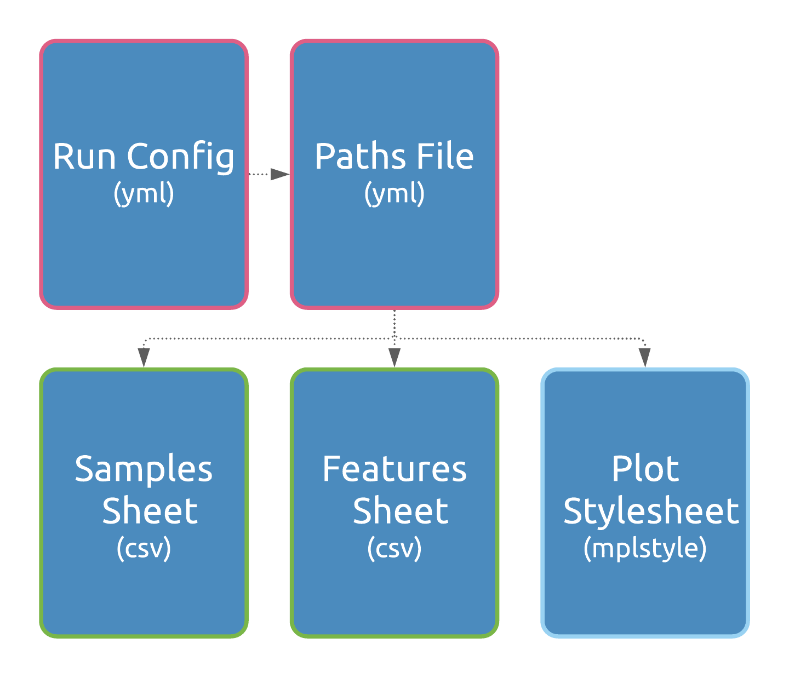

# tinyRNA: comprehensive analysis of small RNA high-throughput sequencing data
:warning: **Under Development & Testing** :warning:

*This repository is being actively developed and tested, and is thus incomplete and only recommended for testing until a release is made. Feedback, suggestions, and bug reports are welcome under the [issues tab](https://github.com/MontgomeryLab/tinyrna/issues). Thank you!*

[](https://travis-ci.com/MontgomeryLab/tinyrna)

- [Getting Started](#getting-started)
  - [Prerequisites & Installation](#prerequisites--installation)
    - [1. Install conda](#1-install-conda)
    - [2. Install R & DESeq2](#2-install-r--deseq2)
    - [3. Install tinyRNA](#3-install-tinyrna)
- [Usage](#usage)
  - [Configuration Files](#configuration-files)
    - [Run Config](#run-config)
    - [Paths File](#paths-file)
    - [Samples Sheet](#samples-sheet)
    - [Features Sheet](#features-sheet)
  - [User-Provided Input Files](#user-provided-input-files)
  - [Running the End-to-End Analysis](#running-the-end-to-end-analysis)
  - [Running Individual Steps](#running-individual-steps)
      - [Create Workflow](#create-workflow)
      - [Collapser](#collapser)
      - [Counter](#counter)
      - [fastp, bowtie-build, and bowtie](#fastp-bowtie-build-and-bowtie)
  - [Using a Different Workflow Runner](#using-a-different-workflow-runner)
- [Outputs](#outputs)
  - [Data Pre-Processing](#data-pre-processing)
  - [Counts and Pipeline Statistics](#counts-and-pipeline-statistics)
    - [Feature Counts](#feature-counts)
    - [Alignment Statistics](#alignment-statistics)
    - [Summary Statistics](#summary-statistics)
    - [5'nt vs. Length Matrix](#5nt-vs-length-matrix)
- [Contributing](#contributing)
- [Authors](#authors)
- [License](#license)


tinyRNA (Automated QUantitative Analysis of Transcript eXpression) is a set of tools to simplify the analysis of next-generation sequencing data. The goal of this specific repository is to provide an entire workflow for processing small RNA sequencing data with options for advanced hierarchical feature selection.

The current workflow is as follows:


Steps outlined in orange are Python scripts we've created for this task, optional steps are teal, and purple steps are part of the end-to-end standard workflow. Outputs are shown in green.

## Getting Started

### Prerequisites & Installation

A conda environment file has been provided for easy installation of the tinyRNA environment and its dependencies.

#### 1. Install conda
To install `conda` you can download and follow instructions for either:
- [Anaconda](https://www.anaconda.com/distribution/), which includes many packages, a few of our dependencies, and additional tools that you may find useful in the context of data science, or
- [Miniconda3](https://docs.conda.io/en/latest/miniconda.html), which contains only conda and its dependencies, so that its installation requires significantly less time and disk space.

See the [conda user guide](https://docs.conda.io/projects/conda/en/latest/user-guide/install/download.html#anaconda-or-miniconda) if you need additional help choosing.

#### 2. Install R & DESeq2
Rather than installing R via conda, we recommend you install it yourself first from [CRAN](https://www.r-project.org/), then install DESeq2 following [instructions](https://bioconductor.org/packages/release/bioc/html/DESeq2.html) in Bioconductor.

#### 3a. XQuartz (mac only)
DESeq2 is quiet about it, but if you're on a mac you'll also need to download and install [XQuartz](https://www.xquartz.org/).

#### 3. Install tinyRNA

To install tinyRNA and its remaining dependencies:
```
# Clone the repository into a local directory
git clone https://github.com/MontgomeryLab/tinyrna.git
cd tinyrna

# Install the tinyrna environment and dependencies
conda env create -f environment.yml

# Activate (or reactivate) the tinyrna environment
conda activate tinyrna

# When you are done running tinyRNA, you can deactivate the conda environment
conda deactivate
```

## Usage
If you'd like to jump right in and start using tinyRNA, see our [tutorial](./START_HERE/TUTORIAL.md).

You can execute the workflow in its entirety for a full end-to-end analysis pipeline, or you can execute individual steps on their own. In most cases you will use the `tinyrna` command for pipeline level operations, including running the pipeline.

### Configuration Files
The pipeline requires that you specify your input library files (Samples Sheet - `samples.csv`), your selection rules for feature counting (Features Sheet - `features.csv`), the paths to your configuration files and other file inputs (Paths - `paths.yml`), and your preferences for the overall pipeline configuration (Run Config - `run_config.yml`).



You can obtain template copies of these files with the command (they're also available in the `START_HERE` directory):
```
tinyrna get-template
```
:warning: You may use either relative or absolute paths in your configuration files. **Relative paths will be evaluated relative to the file in which they are defined.** This means that you can store your configuration files each in a different location, allowing for flexibility in your project organization. To avoid confusion, we recommend using absolute paths.:warning:

#### Run Config

The pipeline revolves around a configuration file to make it easy to set up and run. This `YAML` Run Config file (`run_config.yml`) can be edited using a simple text editor (such as BBEDIT for Mac or notepad++ for Windows). Within it you must define the location of your Paths file (`paths.yml`), and you can optionally define your preferences for the pipeline and its individual steps. During the setup phase of pipeline execution, tinyRNA will further process this configuration file based on its contents and the contents of your Paths (`paths.yml`), Samples (`samples.csv`), and Features (`features.csv`) files. The processed configuration is what ultimately determines the behavior of the workflow. A copy will be saved in the final run directory specified in your Paths file providing a configuration record for each run.

#### Paths File

The locations of pipeline file inputs are defined in the Paths file (`paths.yml`). This `YAML` file includes paths to your Samples and Features Sheets, in addition to your bowtie index prefix (optional) and the final run directory name. The final run directory will contain all pipeline outputs, and is therefore recreated and prepended with the `run_name` and current date and time of each run to keep outputs separate.

#### Samples Sheet

To make it simple to specify your fastq files and their locations, along with associated sample names and replicate numbers, we provide a `csv` file (`samples.csv`) which can be edited in a spreadsheet editor such as Microsoft Excel or LibreOffice Calc.

#### Features Sheet

Small RNAs can often be classified by sequence features, such as length, strandedness, and 5' nucleotide. We provide a Features Sheet (`features.csv`) in which you can define selection rules to more accurately capture counts for the small RNAs of interest.  These rules can be defined per GFF3 file (a file containing the coordinates of features of interest) on the basis of any attribute key/value pair (for example, `Class=miRNA`), strand relative to the feature of interest, 5' end nucleotide, and length, with options for full or partial interval matching with the target sequence.

Selection takes place for every feature associated with every alignment of every small RNA sequence. It occurs in two phases:
1. Against the candidate feature's attribute key/value pairs, as defined in your reference annotation files.
2. Against the small RNA attributes (strand relative to feature of interest, 5' end nucleotide, and length).

Each rule must be assigned a hierarchy value. A lower value indicates higher selection preference and multiple rules may share the same value. We utilize this value only during the first phase of selection; if multiple features match the attribute key/value pairs defined in your rules, then only the feature(s) with the lowest hierarchy values move to the second selection phase. The remaining features are discarded for the given read alignment. You can use the higher hierarchy values to exclude counts features that are not of interest from features of interest. For example, suppose you have a miRNA locus embedded within a coding gene locus (within an intron for example). By assigning a hierarchy of 1 to miRNA and a hierarchy of 2 to coding genes, all small RNA counts from sequences matching to the miRNA would be excluded from total counts for the coding gene. Reversing the hierarchy such that miRNA had a hierarchy of 2 and coding genes had a hierarchy of 1 would instead exclude reads from sequences matching to the coding gene from total counts for the miRNA. If a hierarchy of 1 was assigned to both miRNAs and coding genes, counts for sequences matching both features would be split between them.

Small RNA reads passing selection will receive a normalized count increment. By default, read counts are normalized twice before being assigned to a feature (these settings can be changed in `run_config.yml`). Counts for each small RNA sequence are divided: 
1. By the number of loci it aligns to in the genome.
2. By the number of selected features for each of its alignments.

Final feature counts will be expressed in terms of a particular feature attribute key such as sequence name (often denoted with `ID` in column 9 of the GFF3, e.g. `ID=let-7` ), which must be specified within the `Name Attribute` column of `features.csv`. In many cases, such as the example above, the identifier in the `Name Attribute` column will simply be `ID` and as the GFF3 is scanned, feature identifiers following `ID=` will be used as feature names.

### User-Provided Input Files

Running the pipeline requires the following files:
  1. A GFF3 formatted file with with genomic coordinates for your features of interest, such as miRNAs (see ce_WS279_chrI.gff3 in the reference_data folder for an example)
     - Each feature must have an attributes column (column 9) which defines its `ID` and `Class` (case-sensitive).
       - For example: `chrI	.	miRNA	100	121	.	+	.	ID=miR-1;Class=miRNA`
     - Each feature's `ID` attribute must be unique.
     - All features must be stranded.
     - Attribute values which contain commas will be parsed as lists.
  2. FASTQ(.gz) <sup>*</sup> formatted files with your small RNA high-throughput sequencing data (files must be demultiplexed).
  3. A reference genome file in FASTA format (be sure that chromosome identifiers are identical between your reference annotations and genome sequence files).
  4. Optional: Bowtie indexes (must be small indexes (.ebwt)). By default, bowtie indexes will be created when the pipeline is run for the first time).

<sup>*</sup> `tinyrna-count` accepts SAM files in your Samples Sheet only when invoked as an individual step. Because genome alignments are done after collapsing reads, the pipeline does not currently support SAM files from other sources.

### Running the End-to-End Analysis
In most cases you will use this toolset as an end-to-end pipeline. This will run a full, standard small RNA sequencing data analysis according to your configuration file. Before starting, you will need the following:

1. High-throughput sequencing data in fastq format. 
2. The genome sequence of interest in fasta format.
3. Genome coordinates of small RNA features of interest in gff3 format.
4. A completed Samples Sheet (`samples.csv`) with paths to the fastq files.
5. A completed Features Sheet (`features.csv`) with paths to the gff3 file(s).
6. An updated Paths File (`paths.yml`) with the path to the genome sequence.
7. A Run Config file (`run_config.yml`) located in your working directory or the path to the file. The template provided does not need to be updated if you wish to use the default settings.

To run an end-to-end analysis, be sure that you're working within the conda tinyrna environment (instructions above) in your terminal and optionally set your working directory that contains the Run Config file. Than, simply enter the following code into your terminal (if you are not working in the directory containing `run_config.yml`, provide the path before the name of the file - `path/to/run_config.yml`:

```
tinyrna run --config run_config.yml
```

### Running Individual Steps
The process for running individual steps differs depending on whether the step is an tinyRNA Python component, or a CWL wrapped third party tool.

The following steps are Python components. Their corresponding commands may be invoked at the command line:
##### Create Workflow
```
tinyrna-config -i CONFIG

  required arguments:
    -i CONFIG, --input-file CONFIG
                          The Run Config file to be processed
```
##### Collapser
```
tinyrna-collapse [-h] -i FASTQFILE -o OUTPREFIX [-t THRESHOLD] [-c]

  optional arguments:
    -h, --help            show this help message and exit
    -t THRESHOLD, --threshold THRESHOLD
                          Sequences <= THRESHOLD will be omitted from
                          {prefix}_collapsed.fa and will instead be placed in
                          {prefix}_collapsed_lowcounts.fa
    -c, --compress        Use gzip compression when writing fasta outputs
  
  required arguments:
    -i FASTQFILE, --input-file FASTQFILE
                          The input fastq(.gz) file to collapse
    -o OUTPREFIX, --out-prefix OUTPREFIX
                          The prefix for output files {prefix}_collapsed.fa and,
                          if counts fall below threshold,
                          {prefix}_collapsed_lowcounts.fa
```
##### Counter
```
tinyrna-count [-h] -i SAMPLES -c CONFIGFILE -o OUTPUTPREFIX [-t] [-p]

  optional arguments:
    -h, --help            show this help message and exit
    -t, --intermed-file   Save the intermediate file containing all alignments
                          and associated features.
    -p, --is-pipeline     Indicates that counter was invoked from the tinyrna
                          pipeline and that input files should be sources as
                          such.
  
  required arguments:
    -i SAMPLES, --input-csv SAMPLES
                          the csv samples file/library list
    -c CONFIGFILE, --config CONFIGFILE
                          the csv features configuration file
    -o OUTPUTPREFIX, --out-prefix OUTPUTPREFIX
                          output prefix to use for file names
```
##### fastp, bowtie-build, and bowtie
These are CWL wrapped third party tools.
1. Copy the workflow CWL folder to your current working directory with the command `tinyrna setup-cwl --config none`
2. Within `./CWL/tools` find the file for the step you wish to run. Navigate to this folder in terminal (or copy your target .cwl file to a more convenient location)
3. Run `cwltool --make-template step-file.cwl > step-config.YML`. This will produce a `YML` configuration file specific to this step. Optional arguments will be indicated as such; if you do not wish to set a value for an optional argument, best practice is to remove it from the file
4. Fill in your preferences and inputs in this step configuration file and save it
5. Execute the tool with the command `cwltool step-file.cwl step-config.YML`

### Using a Different Workflow Runner

We have used CWL to define the workflow for scalability and interoperability. The default runner, or interpreter, utilized by tinyRNA is `cwltool`. You may use a different CWL runner if you would like, and in order to do so you will need the workflow CWL and your **processed** Run Config file. The following will copy these files to your current working directory:

```
tinyrna setup-cwl --config <path/to/Run_Config.yml>
```

If you don't have a Run Config file or do not wish to obtain a processed copy, you may instead use "None" or "none" in the `--config` argument:
```
tinyrna setup-cwl --config none
```

## Outputs

The files produced by each pipeline step will be included in the final run directory by default. These intermediate files are organized into subdirectories by step.

### Data Pre-Processing

[fastp](https://github.com/OpenGene/fastp) is used to trim adapters and remove poor quality reads from FASTQ input files. Summary and quality statistics reports are generated for each library. These reports are used to calculate the pipeline summary statistics for total reads and retained reads.

### Counts and Pipeline Statistics
Custom Python scripts are used at the Counter step to generate alignment statistics, pipeline summary statistics, and 5'nt vs. length matrices for each library.

#### Feature Counts
Custom Python scripts and HTSeq are used to generate a single table of feature counts that includes columns for each library analyzed. A feature's _Feature ID_ and _Feature Class_ are simply the values of its `ID` and `Class` attributes. We have also included a _Feature Name_ column which displays aliases of your choice, as specified in the Features Sheet. In the _Name Attribute_ column of the Features Sheet, you can choose an additional attribute to be included in the _Feature Name_ column of this table. If the _Name Attribute_ in the Features Sheet is set to`ID`, the _Feature Name_ column is left empty.

For example, if your Features Sheet has a rule which specifies an ID Attribute of `sequence_name` and the GFF entry for this feature has the following attributes column:
```
... ID=406904;sequence_name=mir-1,hsa-miR-1;Class=miRNA; ...
```
The row for this feature in the feature counts table would read:

| Feature ID | Feature Name | Feature Class | Group1_rep_1 | Group1_rep_2 | ... |
|------------|--------------|---------------|-----------|-----------|-----|
| 406904 | mir-1,hsa-miR-1 | miRNA | 1234 | 999 | ... |


#### Alignment Statistics
A single table of alignment statistics includes columns for each library and the following rows:
- Total Assigned Reads (i.e. counts from sequences that aligned to at least one feature in your Features Sheet)
- Total Assigned Sequences (i.e. unique sequences that aligned to at least one feature in your Features Sheet)
- Assigned Single-Mapping Reads (i.e. counts from sequences mapping to a single genomic locus and aligning to at least one feature in your Features Sheet)
- Assigned Multi-Mapping Reads (i.e. counts from sequences mapping to multiple genomic loci that aligned to at leats one feature in your Features Sheet)
- Reads Assigned to Single Feature (i.e. counts from sequences that aligned to a single feature in your Features Sheet)
- Sequences Assigned to Single Feature (i.e. unique sequences that aligned to a single feature in your Features Sheet)
- Reads Assigned to Multiple Features (i.e. counts from sequences that aligned to multiple features in your Features Sheet)
- Sequences Assigned to Multiple Features (i.e. unique sequences that aligned to multiple features in your Features Sheet)
- Total Unassigned Reads (i.e. total counts for sequences that didn't align to any features in your Features Sheet)
- Total Unassigned Sequences (i.e. total unique sequences that didn't align to any features in your Features Sheet)

#### Summary Statistics
A single table of summary statistics includes columns for each library and the following rows:
- Total Reads (i.e. total reads represented in FASTQ input files)
- Retained Reads (i.e. total reads passing quality filtering)
- Unique Sequences (i.e. total unique sequences passing quality filtering)
- Mapped Sequences (i.e. total genome-mapping sequences passing quality filtering)
- Aligned Reads (i.e. total genome-mapping reads passing quality filtering that were aligned to at least one feature in your Features Sheet)

#### 5'nt vs. Length Matrix

After alignment, a size and 5'nt distribution table is created for each library. The distribution of lengths and 5'nt can be used to assess the overall quality of your libraries. This can also be used for analyzing small RNA distributions in non-model organisms without annotations.

## Contributing

See the [CONTRIBUTING.md](CONTRIBUTING.md) for guidelines. To see what is actively being worked or planned go to the [projects tab](https://github.com/MontgomeryLab/tinyrna/projects) or the [issues tab](https://github.com/MontgomeryLab/tinyrna/issues).

## Authors

* **Kristen Brown** - 2018-2019 - Colorado State University - [biokcb](https://github.com/biokcb)
* **Alex Tate** - 01/2021-present - Colorado State University - [AlexTate](https://github.com/AlexTate)

See also the list of [contributors](https://github.com/MontgomeryLab/tinyrna/contributors) who participated in this project.

## License

This project is licensed under the GPLv3 license (along with HTSeq, bowtie). License - see the [LICENSE.md](LICENSE.md) file for details
