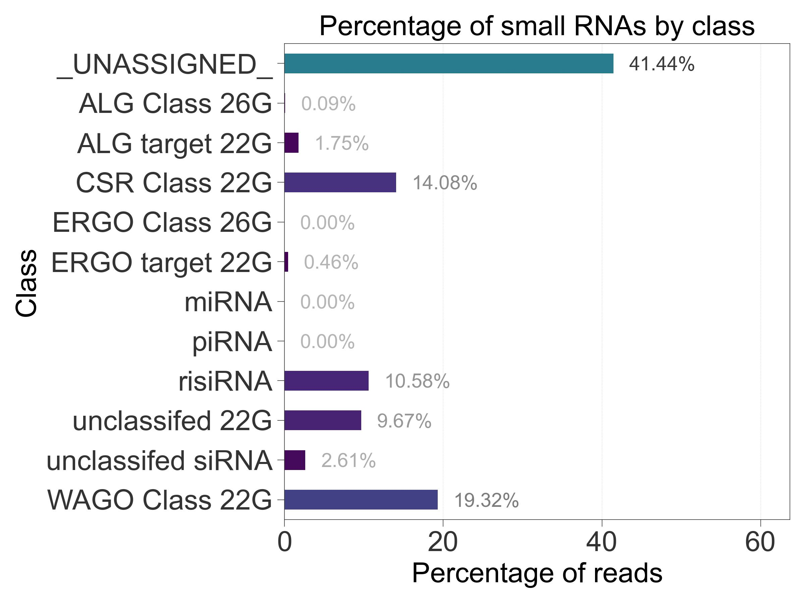

# tinyRNA: precision analysis of small RNA high-throughput sequencing data

*Feedback, suggestions, and bug reports are welcome under the [issues tab](https://github.com/MontgomeryLab/tinyrna/issues). Thank you!*

- [Installation](#tinyrna-installation)
- [Usage](#usage)
  - [Configuration Files](#configuration-files)
  - [User-Provided Input Files](#requirements-for-user-provided-input-files)
  - [Running the End-to-End Analysis](#running-an-end-to-end-analysis)
  - [Resuming an End-to-End Analysis](#resuming-an-end-to-end-analysis)
- [Workflow Steps](#workflow-steps)
- [Outputs](#outputs)
  - [Data Pre-Processing](#data-pre-processing)
  - [Collapsed FASTA files](#collapsed-fasta-files)
  - [Counts and Pipeline Statistics](#counts-and-pipeline-statistics)
  - [Differential Expression Analysis](#differential-expression-analysis)
  - [Plots](#plots)
- [Contributing](#contributing)
- [Authors](#authors)
- [License](#license)


tinyRNA is a set of tools to simplify the analysis of next-generation sequencing data. The goal of this specific repository is to provide an entire workflow for processing small RNA sequencing data with user-defined hierarchical feature selection rules.

### The Current Workflow


## tinyRNA Installation

### Stable Releases
1. Download the latest release from the [releases link](https://github.com/MontgomeryLab/tinyRNA/releases) on the sidebar
2. Decompress the archive and navigate to the resulting directory in your terminal
3. Run `./setup.sh` to install the project and its dependencies in a conda environment named "tinyrna"

#### Installation Tips
- If the installation script runs the Miniconda installer:
  - Press "q" if you find yourself trapped on the license page
  - We recommend answering "yes" to running `conda init`
- A custom environment name can be passed as the first argument to `setup.sh`

### Development Releases
This option provides the latest features but stable releases are more rigorously tested.
```shell
# Clone the repository into a local directory
 git clone https://github.com/MontgomeryLab/tinyrna.git
 cd tinyrna

# Install the tinyrna environment and dependencies
 ./setup.sh
```

### Updating an Existing Installation
When it's time to update your installation of tinyRNA, simply repeat the procedure you used for installation. Note that the existing Conda environment, including any additional packages you may have installed within it, will be removed by the installation script.

## tiny-count Standalone Installation
Alternatively, you can install tinyRNA's precision counting tool by itself. Unlike the full tinyRNA suite, this option can be installed in existing conda environments and requires fewer dependencies.

```shell
conda install -c bioconda -c conda-forge tiny-count
```

If you'd like to jump right in and start using tiny-count, see our<br> 
👉 [tutorial](START_HERE/tiny-count_TUTORIAL.md) 👈

## Usage

The `tinyrna` conda environment must be activated before using the tinyRNA workflow.
```shell
# Activate the tinyrna environment
 conda activate tinyrna
 
## (your commands here: tiny run, tiny-count, etc.)

# When you are done running tinyRNA, you can deactivate the conda environment
 conda deactivate
```
If you'd like to jump right in and start using tinyRNA, see our<br> 
👉 [tutorial](START_HERE/tinyRNA_TUTORIAL.md) 👈

You can execute the workflow in its entirety for a full end-to-end analysis pipeline, or you can execute individual steps on their own. In most cases you will use the command `tiny` for pipeline operations.

### Configuration Files
The pipeline requires that you identify:
- Your preferences for the pipeline and its steps via the **Run Config**
- The location of your config files and other file inputs via the **Paths File**
- Your selection preferences for feature counting via the **Features Sheet**
- Your samples via the **Samples Sheet**


For more information, please see the [configuration file documentation](doc/Configuration.md). The `START_HERE` directory demonstrates a working configuration using these files. You can also get a copy of them by running the command:
```shell
tiny get-templates
```


### Requirements for User-Provided Input Files

| Input Type                                                                 | File Extension    | Requirements                                                                                                                                                                                                                                                                                                                                                                                                                                                                                                           |
|----------------------------------------------------------------------------|-------------------|------------------------------------------------------------------------------------------------------------------------------------------------------------------------------------------------------------------------------------------------------------------------------------------------------------------------------------------------------------------------------------------------------------------------------------------------------------------------------------------------------------------------|
| Reference annotations<br/>[(example)](START_HERE/reference_data/ram1.gff3) | GFF3 / GFF2 / GTF | Column 9 attributes (defined as "tag=value" or "tag value"):<ul><li>Each feature must have an `ID` or `gene_id`  or `Parent` tag (referred to as `ID` henceforth).</li><li>Discontinuous features must be defined with the `Parent` tag whose value is the logical parent's `ID`, or by sharing the same `ID`.</li><li>Attribute values containing commas must represent lists.</li><li>`Parent` tags with multiple values are not yet supported.</li><li>See the example link (left) for col. 9 formatting.</li></ul> |
| Sequencing data<br/>[(example)](START_HERE/fastq_files)                    | FASTQ(.gz)        | Files must be demultiplexed.                                                                                                                                                                                                                                                                                                                                                                                                                                                                                           |
| Reference genome<br/>[(example)](START_HERE/reference_data/ram1.fa)        | FASTA             | Chromosome identifiers (e.g. Chr1): <ul><li>Should match your reference annotation file chromosome identifiers</li><li>Are case sensitive</li></ul>                                                                                                                                                                                                                                                                                                                                                                    |


### Running an End-to-End Analysis
In most cases you will use this toolset as an end-to-end pipeline. This will run a full, standard small RNA sequencing data analysis according to your configuration file. Before starting, you will need the following:

1. High-throughput sequencing data in fastq format. 
2. The genome sequence of interest in fasta format.
3. Genome coordinates of small RNA features of interest in GFF format.
4. A completed Samples Sheet (`samples.csv`) with paths to the fastq files.
5. A completed Features Sheet (`features.csv`) with feature selection rules.
6. An updated Paths File (`paths.yml`) with paths to your GFF files, the genome sequence and/or your bowtie index prefix, as well as the paths to `samples.csv` and `features.csv`.
7. A Run Config file (`run_config.yml`) located in your working directory or the path to the file. The template provided does not need to be updated if you wish to use the default settings.

To run an end-to-end analysis, be sure that you're working within the conda tinyrna environment ([instructions above](#usage)) in your terminal and optionally navigate to the location of your Run Config file. Then, simply run the following in your terminal:

```
tiny run --config run_config.yml
```

### Resuming an End-to-End Analysis

The tiny-count and tiny-plot steps offer a wide variety of options for refining your analysis. You might find that repeat analyses are required while tuning these options to your goals. To save time and skip redundant compute-heavy preprocessing steps, you can resume a prior analysis using its outputs from the early pipeline steps.

```shell
# Resume a prior analysis at the tiny-count step
tiny recount --config processed_run_config.yml

# Resume a prior analysis at the tiny-plot step
tiny replot --config processed_run_config.yml
```
For more information and prerequesites, see the [pipeline resume documentation](doc/Pipeline.md#resuming-a-prior-analysis).

### CWL-Wrapped Third Party Tools.
fastp, bowtie-build, and bowtie can be run from the terminal (within the tinyRNA conda environment) just as you would if they were installed in the host environment. Normally, tinyRNA will handle the execution of these tools for you, but if you would like to run them as individual steps you may find that their commandline arguments can be lengthy. With a little setup you can make things easier for yourself by using our CWL wrappers and a configuration file for each tool. This allows you to more easily set commandline parameters from a text editor and reuse configuration files. See the [pipeline documentation](doc/Pipeline.md#cwl-wrapped-third-party-tools) for details.

## Workflow Steps
See the current [workflow diagram](#the-current-workflow) for a bird's eye view of the workflow. 

### `tiny-config`
At the beginning of pipeline execution, tinyRNA digests your configuration files and produces a processed Run Config which determine's how the CWL runner, `cwltool`, directs the workflow. If you would like to produce a processed Run Config without running the rest of the pipeline, you can do so with the command `tiny-config --input-file your_run_config.yml`. This is useful if you wish to use an alternative CWL runner. In most circumstances you will not need to use this command.

### `fastp`
[fastp](https://github.com/OpenGene/fastp) is used to trim adapters and remove poor quality reads from FASTQ input files. Summary and quality statistics reports are generated for each library.

### `tiny-collapse`
After quality filtering, unique sequences are counted in each library and a FASTA file is produced which contains only these unique sequences and their counts. This "collapsing" process significantly reduces the resource demands of genomic alignment and feature counting. tiny-collapse can also trim the degenerate bases often included in the adapter sequences used in library preparation.

### `bowtie`
Genomic alignment of collapsed reads is performed by [bowtie](http://bowtie-bio.sourceforge.net/manual.shtml).

### `tiny-count`
At the core of tinyRNA is tiny-count, a highly flexible counting utility that allows for hierarchical assignment of small RNA reads to features based on positional information, extent of feature overlap, 5’ nucleotide, length, and strandedness. The parameters of selection are defined in the Features Sheet. 

[Full documentation for tiny-count can be found here.](doc/tiny-count.md)


### `tiny-deseq.r`
A wrapper R script for DESeq2 facilitates DGE analysis of counted sample files.

### `tiny-plot`
The results of feature counting and DGE analysis are visualized with high resolution plot PDFs. User-defined plot styles are also supported via a Matplotlib style sheet. 

[Full documentation for tiny-plot can be found here.](doc/tiny-plot.md)

## Outputs

The files produced by each pipeline step are included in the final output directory where they are organized into subdirectories by step.

### Data Pre-Processing

[fastp](https://github.com/OpenGene/fastp) is used to trim adapters and remove poor quality reads from FASTQ input files. Summary and quality statistics reports are generated for each library. These reports are used to calculate the pipeline summary statistics for total reads and retained reads.

### Collapsed FASTA files
A "collapsed" FASTA contains unique reads found in fastp's quality filtered FASTQ files. Each header indicates the number of times that sequence occurred in the input. This allows for faster bowtie alignments while preserving counts for downstream analysis.

### Counts and Pipeline Statistics
The tiny-count step produces a variety of outputs

#### Feature Counts
Custom Python scripts and HTSeq are used to generate a single table of feature counts which includes each counted library. Each matched feature is represented with the following metadata columns:
- **_Feature ID_** is determined, in order of preference, by one of the following GFF column 9 attributes: `ID`, `gene_id`, `Parent`. 
- **_Classifier_** is determined by the rules in your Features Sheet. It is the _Classify as..._ value of each matching rule. Since multiple rules can match a feature, some Feature IDs will be listed multiple times with different classifiers.
- **_Feature Name_** displays aliases of your choice, as specified in the `alias` key under each GFF listed in your Paths File. If `alias` is set to `ID`, the _Feature Name_ column is left empty.

For example, if your Paths File has a GFF entry which specifies `alias: [sequence_name]`, and the corresponding GFF file has a feature with the following attributes column:
```
... ID=406904;sequence_name=mir-1,hsa-miR-1; ...
```
And this feature matched a rule in your Features Sheet defining _Classify as..._ `miRNA`, then the entry for this feature in the final counts table would read:

| Feature ID | Classifier | Feature Name     | Group1_rep_1 | Group1_rep_2 | ... |
|------------|------------|------------------|--------------|--------------|-----|
| 406904     | miRNA      | mir-1, hsa-miR-1 | 1234         | 999          | ... |

#### Normalized Counts
If your Samples Sheet has settings for Normalization, an additional copy of the Feature Counts table is produced with the specified per-library normalizations applied. Note that these normalizations are [unrelated to normalization by genomic/feature hits](doc/Configuration.md#applying-custom-normalization).

#### Counts by Rule
This table shows the counts assigned by each rule on a per-library basis. It is indexed by the rule's corresponding row number in the Features Sheet, where the first non-header row is considered row 0. For convenience a Rule String column is added which contains a human friendly concatenation of each rule. Finally, a Mapped Reads row is added which represents each library's total read counts which were available for assignment prior to counting/selection.

#### Alignment Statistics
A single table of alignment statistics includes columns for each library and the following stats:

| Stat                                                 | Description                                                                                                         |
|------------------------------------------------------|---------------------------------------------------------------------------------------------------------------------|
| Total Assigned Reads                                 | Counts from sequences that aligned to at least one feature in your Features Sheet                                   |
| Total Unassigned Reads                               | Total counts for sequences that didn't align to any features in your Features Sheet                                 |
| Total Assigned Sequences                             | Unique sequences that aligned to at least one feature in your Features Sheet                                        |
| Total Unassigned Sequences                           | Total unique sequences that didn't align to any features in your Features Sheet                                     |
| Assigned Single-Mapping Reads                        | Counts from sequences mapping to a single genomic locus and aligning to at least one feature in your Features Sheet |
| Assigned Multi-Mapping Reads                         | Counts from sequences mapping to multiple genomic loci that aligned to at leats one feature in your Features Sheet  |
| Reads Assigned to Single Feature                     | Counts from sequences that aligned to a single feature in your Features Sheet                                       |
| Sequences Assigned to Single Feature                 | Unique sequences that aligned to a single feature in your Features Sheet                                            |
| Reads Assigned to Multiple Features                  | Counts from sequences that aligned to multiple features in your Features Sheet                                      |
| <nobr>Sequences Assigned to Multiple Features</nobr> | Unique sequences that aligned to multiple features in your Features Sheet                                           |

#### Summary Statistics
A single table of summary statistics includes columns for each library and the following stats:

| Stat                          | Description                                                                                                                                |
|-------------------------------|--------------------------------------------------------------------------------------------------------------------------------------------|
| Total Reads                   | Total reads represented in FASTQ input files                                                                                               |
| Retained Reads                | Total reads passing quality filtering                                                                                                      |
| Unique Sequences              | Total unique sequences passing quality filtering                                                                                           |
| <nobr>Mapped Sequences</nobr> | Total genome-mapping sequences passing quality filtering                                                                                   |
| Mapped Reads                  | Total genome-mapping reads passing quality filtering prior to counting/selection                                                           |                                                          |
| Assigned Reads                | Total genome-mapping reads passing quality filtering that were assigned to at least one feature due to a rule match in your Features Sheet |

When normalization by feature and/or genomic hits is disabled, the following stats are reported instead of `Mapped Reads`:

| Stat                        | Description                                                                      |
|-----------------------------|----------------------------------------------------------------------------------|
| Normalized Mapped Reads     | The true mapped read count                                                       |
| Non-normalized Mapped Reads | The sum of assigned and unassigned reads according to the normalization settings |

#### 5'nt vs. Length Matrix

During counting, size and 5' nt distribution tables are created for each library. The distribution of lengths and 5' nt can be used to assess the overall quality of your libraries. This can also be used for analyzing small RNA distributions in non-model organisms without annotations.

Two tables are produced:
- **... mapped_nt_len_dist.csv**: full counts from all mapped sequences regardless of feature assignment
- **... assigned_nt_len_dist.csv**: only the assigned counts for sequences receiving feature assignment

#### Diagnostics

Diagnostic information can optionally be produced. If enabled, tiny-count will provide a table for each library which contains feature assignment info on a per-alignment basis, along with a single table that summarizes unassigned counts.

The alignment tables (**... alignment_table.csv**) include the following information per-alignment:

| Column           | Description                                                                                                                                                                                                                                                                           |
|------------------|---------------------------------------------------------------------------------------------------------------------------------------------------------------------------------------------------------------------------------------------------------------------------------------|
| Sequence         | The read sequence, reverse complemented if antisense                                                                                                                                                                                                                                  |
| Raw Count        | The sequence's original read count                                                                                                                                                                                                                                                    |
| Normalized Count | The reads available for assignment to features (the sequence's original read count optionally normalized by genomic hits)                                                                                                                                                             |
| Genomic Hits     | The number of alignments produced for the sequence                                                                                                                                                                                                                                    |
| Chrom            | The alignment's RNAME field                                                                                                                                                                                                                                                           |
| Strand           | The alignment's strand                                                                                                                                                                                                                                                                |
| Start            | The alignment's 1-based start coordinate                                                                                                                                                                                                                                              |
| End              | The alignment's 1-based end coordinate (closed interval)                                                                                                                                                                                                                              |
| Mismatches       | The alignment's reported mismatches between the query sequence and the reference                                                                                                                                                                                                      |
| Candidates       | The number of features overlapping the alignment by at last one nucleotide                                                                                                                                                                                                            |
| Feature Hits     | The feature ID and assigning rule's classifier for all features assigned to the alignment, formatted as `(feature_id, classifier); (...)`. If the match was made by an unclassified rule then classifier is left empty. If no features were assigned the cell is left blank.          |
| Feature Aliases  | The user-defined aliases for all features assigned to the alignment, formatted as `(alias1, alias2, ...); (...)` where the index of each alias grouping matches the index of the corresponding feature in the Feature Hits column. If a feature has no aliases then `()` is reported. |


The unassigned counts table (**assignment_diags.csv**) includes the following, with a column per library:

| Stat                              | Description                                                                                                                                   |
|-----------------------------------|-----------------------------------------------------------------------------------------------------------------------------------------------|
| <nobr>Uncounted alignments</nobr> | The number of alignments that did not receive any feature assignments. This stat has two entries, one for each strand.                        |
| No feature counts                 | The total unassigned counts due to alignments that failed to overlap any features                                                             |
| Eliminated counts                 | The total unassigned counts due to alignments whose candidate features were _ALL_ eliminated because they failed to match any selection rules |

### Differential Expression Analysis
DGE is performed using the `DESeq2` R package. Our wrapper script reports differential expression tables for your experiment design, and a table of normalized feature counts. If your control condition is indicated in your Samples Sheet then pairwise comparisons will be  made against the control. If a control condition is not indicated then all possible bidirectional pairwise comparisons are made. 

### Plots
Simple static plots are generated from the outputs of tiny-count and tiny-deseq.r. These plots are useful for assessing the quality of your experiment design and the quality of your libraries. The available plots are:
- **len_dist**: A stacked barchart showing size & 5' nucleotide distribution; one output for mapped reads and one for assigned reads.
- **rule_charts**: A barchart showing percentages of counts per rule.
- **class_charts**: A barchart showing percentages of counts per class.
- **replicate_scatter**: A scatter plot comparing replicates for all count files given.
- **sample_avg_scatter_by_dge**: A scatter plot comparing all sample groups, with differentially expressed small RNAs highlighted based on P value cutoff.
- **sample_avg_scatter_by_dge_class**: A scatter plot comparing all sample groups, with classes highlighted for differentially expressed small RNAs based on P value cutoff.

|                                                                                                                                              |                                                                                                                            |
|:--------------------------------------------------------------------------------------------------------------------------------------------:|:--------------------------------------------------------------------------------------------------------------------------:|
|                         </br></br>`len_dist`                          |               <br/>`dge_pca_plot`               |
|                  <br/></br>`rule_charts`                  |       <br/></br>`class_charts`       |
| <br/></br>`sample_avg_scatter_by_dge_class` | <br/></br>`sample_avg_scatter_by_dge` |


tiny-deseq.r will produce a standard **PCA plot** from variance stabilizing transformed feature counts. This output is controlled by the `dge_pca_plot` key in the Run Config and by your experiment design. DGE outputs, including the PCA plot, will not be produced for experiments with less than 1 degree of freedom.

### Reducing Storage Usage
The files produced by certain steps can be very large and after several runs this may present significant storage usage. You can remove the following subdirectories from a Run Directory to free up space, but **you will no longer be able to perform recount analyses within it** (i.e. `tiny recount`):
- fastp (though we recommend keeping the reports)
- collapser
- bowtie

Cleanup commands will be added to tinyRNA in a future release, but for now the following command will remove commonly large files while preserving report files:
```shell
# Execute within the Run Directory you want to clean
rm {fastp/*.fastq,{tiny-collapse,bowtie}/*.fa,bowtie/*.sam}
```

## Citation
Tate, A. J., Brown, K. C., & Montgomery, T. A. (2023). tiny-count: A counting tool for hierarchical classification and quantification of small RNA-seq reads with single-nucleotide precision. _Bioinformatics Advances_. https://doi.org/10.1093/bioadv/vbad065


## Contributing

See the [CONTRIBUTING.md](CONTRIBUTING.md) for guidelines. To see what is actively being worked or planned go to the [projects tab](https://github.com/MontgomeryLab/tinyrna/projects) or the [issues tab](https://github.com/MontgomeryLab/tinyrna/issues).

## Authors

* **Alex Tate** - 01/2021-present - Colorado State University - [AlexTate](https://github.com/AlexTate)
* **Kristen Brown** - 2018-2019 - Colorado State University - [biokcb](https://github.com/biokcb)

See also the list of [contributors](https://github.com/MontgomeryLab/tinyrna/contributors) who participated in this project.

## License

This project is licensed under the GPLv3 license (along with HTSeq, bowtie). License - see the [LICENSE.md](LICENSE.md) file for details
