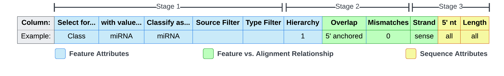

# Configuration Files
The pipeline requires that you identify:
- Your preferences for the pipeline and its steps via the *Run Config*
- The location of your config files and other file inputs via the *Paths File*
- Your selection preferences for feature counting via the *Features Sheet*
- Your samples via the *Samples Sheet*


The `START_HERE` directory demonstrates a working configuration using these files. You can also get a copy of them (and other optional template files) with:
```
tiny get-templates
```

## Overview

>**Tip**: You can use either relative or absolute paths for your file inputs. **Relative paths will be evaluated relative to the file in which they are defined.** This allows you to flexibly organize and share configurations between projects.

#### Run Config

The overall behavior of the pipeline and its steps is determined by the Run Config file (`run_config.yml`). This YAML file can be edited using a simple text editor. Within it you must specify the location of your Paths File (`paths.yml`). All other settings are optional. [More info](#run-config-details).

#### Paths File

The locations of pipeline file inputs are defined in the Paths file (`paths.yml`). This YAML file includes paths to your configuration files, your GFF files, and your bowtie indexes and/or reference genome. [More info](#paths-file-details).

#### Samples Sheet

To make it simple to specify your fastq files and their locations, along with associated sample names and replicate numbers, we provide a CSV file (`samples.csv`) which can be modified in a spreadsheet editor such as Microsoft Excel or LibreOffice Calc. [More info](#samples-sheet-details).

#### Features Sheet

Small RNAs can often be classified by sequence characteristics, such as length, strandedness, and 5' nucleotide. We provide a Features Sheet (`features.csv`) in which you can define selection rules to more accurately capture counts for the small RNAs of interest. [More info](#features-sheet-details).

#### Plot Style Sheet

Plot styles can be optionally overridden using a matplotlibrc style sheet. [More info](#plot-style-sheet-details).

## Editing YAML Files
The Run Config and Paths File are YAML formatted files that can be edited with a text editor. Changing values in these files is pretty straight forward, but it is useful to know a little about YAML syntax.

#### Comments
```yaml
# Lines beginning with a # are comments.
# We've used block comments to designate sections
# and to provide documentation locality
```

#### Key-Value Pairs
```yaml
this-is-a-key: "and this is the key's value"
```

#### Empty / Unassigned Values
```yaml
empty-1:
empty-2: ''
empty-3: ""
empty-4: ~
```

#### Lists
```yaml
# Notice: dashes are at the same indentation level; each item begins with dash space
reference_genome_files:
- ../relative/path/genome1.fasta
- /absolute/path/genome2.fasta

# Brackets can be used for more compact lists
alias: [attribute1, attribute2, attribute3]
```

#### Strings
```yaml
quoted-string-key: "this is a string"
unquoted-scalar: this is also a valid string
# Beware: unquoted scalars cannot contain a colon followed by a space
```

#### Booleans
```yaml
valid-1: true
valid-2: TrUe
invalid: 'true'  # <-- This is a string, not a boolean
```

## Run Config Details

### The processed Run Config
When the pipeline starts up, tinyRNA will process the Run Config based on the contents of it and your other configuration files, and the processed copy will be saved to your run directory. The processed configuration is what ultimately determines the behavior of the workflow. This provides auto-documentation for all of your pipeline runs.

## Paths File Details

### GFF Files
GFF annotations are optional but recommended. If not provided, tiny-count will perform [sequence-based counting](tiny-count.md#sequence-based-counting-mode) rather than feature-based counting. For each file, you can optionally provide an `alias` which is a list of attributes to represent each feature in the Feature Name column of output counts tables. Each entry under the `gff_files` parameter must look something like the following mock example:
```yaml
  - path: 'a/path/to/your/file.gff'         # 0 spaces before -
    alias: [optional, list, of attributes]  # 2 spaces before alias

# ^ Each new GFF path must begin with -
```

### Building Bowtie Indexes
If you don't have bowtie indexes already built for your reference genome, tinyRNA can build them for you at the beginning of an end-to-end run and reuse them on subsequent runs with the same Paths File.

To build bowtie indexes:
1. Open your Paths File in a text editor and find the `reference_genome_files` key. Add your reference genome file(s) under this key, one per line with a `- ` in front.
2. Find the `ebwt` key and delete its value.
3. Execute an end-to-end pipeline run.

Once your indexes have been built, your Paths File will be modified such that `ebwt` points to their location (prefix) within your Run Directory. This means that indexes will not be unnecessarily rebuilt on subsequent runs as long as the same Paths File is used. If you need them rebuilt, simply repeat steps 2 and 3 above.

### The Run Directory
The final output directory name has three components: 
1. The `run_name` defined in your Run Config
2. The date and time at pipeline startup
3. The basename of `run_directory` defined in your Paths File

The `run_directory` suffix in the Paths File supports subdirectories; if provided, the final output directory will be named as indicated above, but the subdirectory structure specified in `run_directory` will be retained. 

## Samples Sheet Details
|  _Column:_ | FASTQ/SAM Files     | Sample/Group Name | Replicate Number | Control | Normalization |
|-----------:|---------------------|-------------------|------------------|---------|---------------|
| _Example:_ | cond1_rep1.fastq.gz | condition1        | 1                | True    | RPM           |

### Assigning the Control Group
Assigning the control group allows the proper DGE comparisons to be made and plotted. The Control column is where you'll make this indication by writing `true` on any corresponding row. Regardless of the number of replicates in each group, only one row needs to have this indication.

tinyRNA doesn't support experiments with more than one control condition. However, if you omit all control condition labels then every possible comparison will be made which should include the desired comparisons.

### Applying Custom Normalization
Custom normalization can be applied at the conclusion of feature counting using the Normalization column. Unlike the Control column, values in the Normalization column apply to the specific library that they share a row with.

Supported values are:
- **Blank or 1**: no normalization is applied to the corresponding library
- **Any number**: the corresponding library's counts are divided by this number (useful for spike-in normalization)
- **RPM or rpm**: the corresponding library's counts are divided by (its mapped read count / 1,000,000)

>**NOTE**: These normalizations operate independently of tiny-count's --normalize-by-hits commandline option. The former is concerned with per-library normalization, whereas the latter is concerned with normalization by selected feature count at each locus ([more info](tiny-count.md#count-normalization)). The commandline option does not enable or disable the normalizations detailed above.

### Low DF Experiments
DESeq2 requires that your experiment design has at least one degree of freedom. If your experiment doesn't include at least one sample group with more than one replicate, tiny-deseq.r will be skipped and DGE related plots will not be produced.

## Features Sheet Details


The Features Sheet allows you to define selection rules that control how reads are assigned to features. We refer to each row as a rule, and columns as a selectors. `Classify as...` isn't a selector because it is used for labelling and subsetting matches rather than determining them. See [tiny-count's documentation](tiny-count.md#feature-selection) for an explanation of the selection process and the role that each selector plays.

### Selector Formats
Selectors in the Features Sheet can be specified as a single value, a list of comma separated values, a range, or a wildcard. The supported formats vary from selector to selector.  For list and range formats, just one of the specified values has to match for the target to be selected. Wildcard formats can be implicitly defined with a blank cell, or explicitly defined using the example keywords below.

| Selector        | Wildcard | Single | List | Range | 
|:----------------|:--------:|:------:|:----:|:-----:|
| `Select for...` |    ✓     |   ✓    |      |       |
| `with value...` |    ✓     |   ✓    |      |       |
| `Source Filter` |    ✓     |   ✓    |  ✓   |       |
| `Type Filter`   |    ✓     |   ✓    |  ✓   |       |
| `Hierarchy`     |          |   ✓    |      |       |
| `Overlap`       |    ✓     |   ✓    |      |       |
| `Strand`        |    ✓     |   ✓    |      |       |
| `5' nt`         |    ✓     |   ✓    |  ✓   |       |
| `Length`        |    ✓     |   ✓    |  ✓   |   ✓   |

Examples:
- **Wildcard** <sup>†</sup>: `any`, `all`, `*`, or a blank cell
- **Single**: `G` or `22`
- **List**: `C,G,U` or `25, 26` (spaces do not matter)
- **Range**: `20-25`
- **Mixed** <sup>§</sup>: `19, 21-23, 25-30` 

<sup>†</sup> the `Strand` selector also supports `both`<br>
<sup>§</sup> only supported by the `Length` selector

### Case Sensitivity
All selectors are case-insensitive.

## Plot Style Sheet Details
Matplotlib uses key-value "rc parameters" to allow for customization of its properties and styles, and one way these parameters can be specified is with a [matplotlibrc file](https://matplotlib.org/3.5.2/tutorials/introductory/customizing.html#a-sample-matplotlibrc-file), which we simply refer to as the Plot Style Sheet. You can obtain a copy of the default style sheet used by tiny-plot with the command `tiny get-templates`, and your modified style sheet can be passed using the [plot_style_sheet parameter](Parameters.md#style-sheet). Please keep in mind that tiny-plot overrides these defaults for a few specific elements of certain plots. Feel free to reach out if there is a plot style you wish to override but find you are unable to.