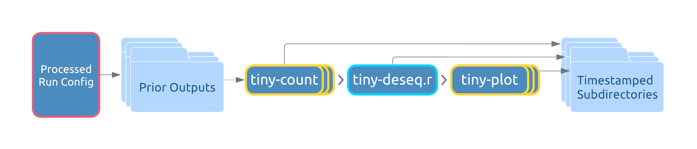

# Pipeline Commands
The following commands deal with pipeline operations for carrying out end-to-end analyses:

```shell
# Retrieving config files
tiny get-template
tiny setup-cwl

# End-to-end analysis
tiny run --config run_config.yml

# Resume prior analyses
tiny recount --config processed_run_config.yml
tiny replot --config processed_run_config.yml
```

## Running End-to-End
The `tiny run` command performs a comprehensive analysis of your [input files](../README.md#requirements-for-user-provided-input-files) according to the preferences defined in your [configuration files](Configuration.md).

## Resuming a Prior Analysis
The tiny-count and tiny-plot steps offer a wide variety of options for refining your analysis. You might find that repeat analyses are required while tuning these options to your goals. However, the earlier pipeline steps (fastp, tiny-collapse, and bowtie) handle the largest volume of data and are resource intensive, so you can save time by reusing their outputs for subsequent analyses. One could do so by running the later steps individually (e.g. using commands `tiny-count`, `tiny-deseq.r`, and `tiny-plot`), but assembling their commandline inputs by hand is labor-intensive and prone to spelling mistakes.

The commands `tiny recount` and `tiny replot` seek to solve this problem. As discussed in the [Run Config documentation](Configuration.md#the-processed-run-config), the Run Directory for each end-to-end analysis will contain a processed Run Config, and this is the file that determines the behavior of a resume run.

<figure align="center">
    <figcaption><b>tiny recount</b></figcaption>
    
    <figcaption><b>tiny replot</b></figcaption>
    
</figure>


You can modify the behavior of a resume run by changing settings in:
- The **processed** Run Config
- The **original** Features Sheet that was used for the end-to-end run (as indicated by the `features_csv` key in the **processed** Run Config)

### The Steps
1. Make and save the desired changes in the files above
2. In your terminal, `cd` to the Run Directory of the end-to-end run you wish to resume
3. Run the desired resume command

### A Note on File Inputs
File inputs are sourced from the **original** output subdirectories of prior steps in the target Run Directory. For `tiny replot`, this means that files from previous executions of `tiny recount` will **not** be used as inputs; only the original end-to-end outputs are used.

### Where to Find Outputs from Resume Runs
Output subdirectories for resume runs can be found alongside the originals, and will have a timestamp appended to their name to differentiate them.

## Parallelization
Most steps in the pipeline run in parallel to minimize runtimes. This is particularly advantageous for multiprocessor systems like server environments. However, parallelization isn't always beneficial. If your computer doesn't have enough free memory, or if you have a large sample file set and/or reference genome, parallel execution might push your machine to its limits. When this happens you might see memory errors or your computer may become unresponsive. In these cases it makes more sense to run resource intensive steps one at a time, in serial, rather than in parallel. To do so, set `run_parallel: false` in your Run Config. This will affect fastp, tiny-collapse, and bowtie since these steps typically handle the largest volumes of data.

## CWL Setup Options
### CWL-Wrapped Third Party Tools.
fastp, bowtie-build, and bowtie can be run from the terminal (within the tinyRNA conda environment) just as you would if they were installed in the host environment. Commandline arguments for these tools can be lengthy, but with a little setup you can make things easier for yourself by using our CWL wrappers and a configuration file for each tool. This allows you to more easily set commandline parameters from a text editor and reuse configurations.
1. Copy the workflow CWL folder to your current working directory with the command `tiny setup-cwl --config none`
2. Within `./CWL/tools` find the file for the step you wish to run. Navigate to this folder in terminal (or copy your target .cwl file to a more convenient location)
3. Run `cwltool --make-template step-file.cwl > step-config.YML`. This will produce a `YML` configuration file specific to this step. Optional arguments will be indicated as such; if you do not wish to set a value for an optional argument, best practice is to remove it from the file
4. Fill in your preferences and inputs in this step configuration file and save it
5. Execute the tool with the command `cwltool step-file.cwl step-config.YML`

### Using a Different Workflow Runner

We have used CWL to define the workflow for scalability and interoperability. The default runner, or interpreter, utilized by tinyRNA is `cwltool`. You may use a different CWL runner if you would like, and in order to do so you will need the workflow CWL and your **processed** Run Config file. 

To obtain a processed Run Config file without running the pipeline:
```
tiny-config --input-file <path/to/your/Run_Config.yml>
```

To copy the workflow CWL to your current working directory:

```
tiny setup-cwl --config <path/to/Run_Config.yml>
```

If you don't have a Run Config file or do not wish to obtain a processed copy, you may instead use "None" or "none" in the `--config` argument:
```
tiny setup-cwl --config none
```
