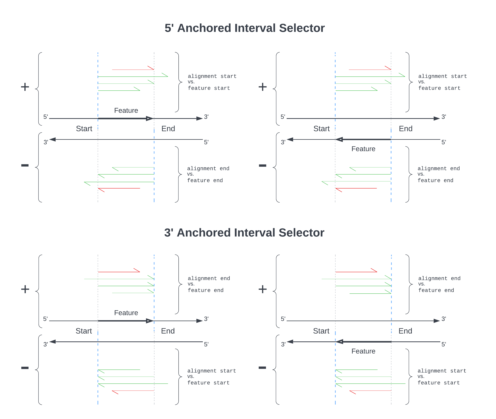
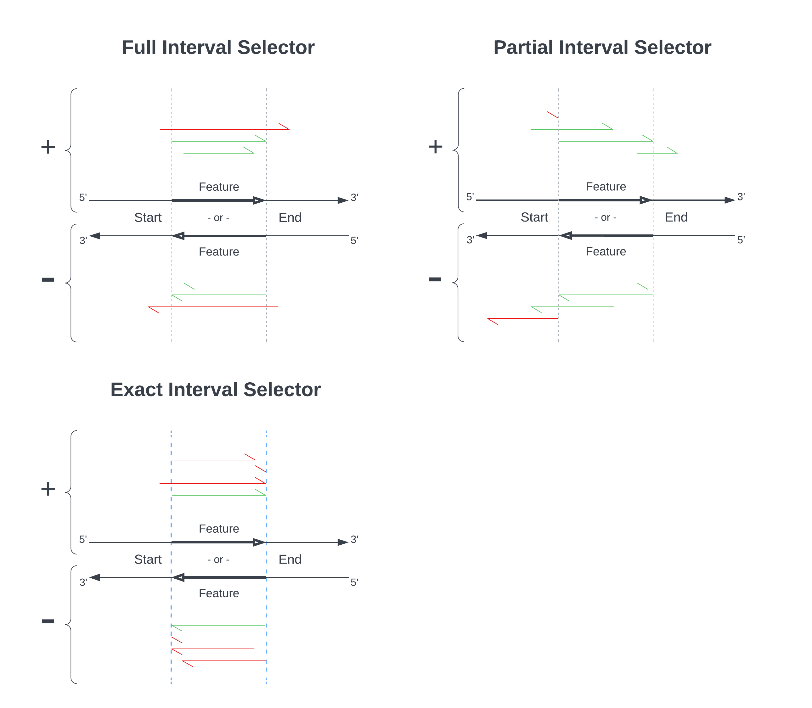

# Operation Details

## Parameters
For an explanation of tiny-count's parameters in the Run Config and by commandline, see [the parameters documentation](Parameters.md#tiny-count).

## Resuming an End-to-End Analysis
tiny-count offers a variety of options for refining your analysis. You might find that repeat analyses are required while tuning these options to your goals. However, the earlier pipeline steps are resource and time intensive, so it is inconvenient to rerun an end-to-end analysis to test new selection rules. Using the command `tiny recount`, tinyRNA will run the workflow starting at the tiny-count step using inputs from a prior end-to-end run. See the [pipeline resume documentation](Pipeline.md#resuming-a-prior-analysis) for details and prerequesites.

## Running as a Standalone Tool
If you would like to run tiny-count as a standalone tool, not as part of an end-to-end or resumed analysis, you can do so with the command `tiny-count`. The command requires that you specify the paths to your Samples Sheet and Features Sheet, and a filename prefix for outputs. [All other arguments are optional](Parameters.md#full-tiny-count-help-string). You will need to make a copy of your Samples Sheet and modify it so that the `Input FASTQ Files` column instead contains paths to the corresponding SAM files from a prior end-to-end run. SAM files from third party sources are also supported, and can be produced from reads collapsed by tiny-collapse or fastx, or from non-collapsed reads. SAM files from non-collapsed reads will result in substantially higher resource usage and runtimes, so we strongly recommend collapsing prior to alignment.

>**Important:** reusing the same output filename prefix between standalone runs will result in prior outputs being overwritten.

# Feature Selection
We provide a Features Sheet (`features.csv`) in which you can define selection rules to more accurately capture counts for the small RNAs of interest. The parameters for these rules include attributes commonly used in the classification of small RNAs, such as length, strandedness, and 5' nucleotide. They are utilized at each alignment locus to determine which overlapping features should be assigned a portion of the read counts for the given sequence.

>**Important**: candidate features do not receive counts if they do not pass selection process described below

Selection occurs in three stages, with the output of each stage as input to the next:
1. Features are matched to rules based on their GFF column 9 attributes
2. Features which overlap an alignment are eliminated based on the hierarchy values and desired overlap characteristics defined in their mached rules
3. Remaining feature candidates are then selected based on the small RNA attributes of the alignment to which they are being assigned. These attributes are, again, defined in each feature's matched rules

## Stage 1: Feature Attribute Parameters
| _features.csv columns:_ | Select for... | with value... | Tag |
|-------------------------|---------------|---------------|-----|

Each feature's column 9 attributes are searched for the key-value combinations defined in the `Select for...` and `with value...` columns. Features, and the rules they matched, are retained for later evaluation at alignment loci in Stages 2 and 3.

#### Value Lists
Attribute keys are allowed to have multiple comma separated values, and these values are treated as a list; only one of the listed values needs to match the `with value...` to be considered a valid match to the rule. For example, if a rule contained `Class` and `WAGO` in these columns, then a feature with attributes `... ;Class=CSR,WAGO; ...` would be considered a match for the rule.

>**Tip**: The rules defined in your Features Sheet are case-insensitive. You do not need to match the capitalization of your target attributes.

#### Wildcard Support
Wildcard values (`all`, `*`, or an empty cell) can be used in the `Select for...` / `with value...` fields. With this functionality you can evaluate features for the presence of an attribute key without regarding its values, or you can check all attribute keys for the presence of a specific value, or you can skip Stage 1 selection altogether to permit the evaluation of the complete feature set in Stage 2. In the later case, feature-rule matching pairs still serve as the basis for selection; each rule still applies only to its matching subset from previous Stages.

#### Tagged Counting (advanced)
You can optionally specify a tag for each rule. Feature assignments resulting from tagged rules will have reads counted separately from those assigned by non-tagged rules. This essentially creates a new "sub-feature" for each feature that a tagged rule matches, and these "sub-features" are treated as distinct during downstream DGE analysis. Additionally, these counts subsets can be pooled across any number of rules by specifying the same tag. We recommend using tag names which _do not_ pertain to the `Select for...` / `with value...` in order to avoid potentially confusing results in class-related plots. 

## Stage 2: Hierarchy and Overlap Parameters
| _features.csv columns:_ | Hierarchy | Overlap |
|-------------------------|-----------|---------|

This stage of selection is concerned with the interval overlap between alignments and features. **Overlap is determined in a strandless fashion.** See the [Strand](#strand) section in Stage 3 for refinement of selections by strand.

### Hierarchy
Each rule must be assigned a hierarchy value. This value is used to perform elimination when multiple features, or multiple feature-rule pairs, overlap an alignment locus.
- Each feature can have multiple hierarchy values if it matched more than one rule during Stage 1 selection
- Multiple rules are allowed to share the same value
- Only the lowest value is selected at each locus

>**Important:**
Let's take a step back. What exactly is the product of selection here? Not just a feature, but a feature _and_ a rule it had matched during Stage 1 selection. This is an important distinction because in Stage 3, only the **selected rule(s)** will be used to determine if the corresponding feature is an appropriate assignment based on the alignment's attributes.

You can use higher hierarchy values to exclude features that are not of interest.

>**Example:** suppose you have a miRNA locus embedded within a coding gene locus (within an intron for example). By assigning a hierarchy of 1 to miRNA and a hierarchy of 2 to coding genes, all small RNA counts from sequences matching to the miRNA would be excluded from total counts for the coding gene. Reversing the hierarchy such that miRNA had a hierarchy of 2 and coding genes had a hierarchy of 1 would instead exclude reads from sequences matching to the coding gene from total counts for the miRNA. If a hierarchy of 1 was assigned to both miRNAs and coding genes, counts for sequences matching both features would be split between them.

### Overlap
This column allows you to specify which read alignments should be assigned based on how their start and end points overlap with candidate features. Candidates for each matched rule can be selected using the following options:
- `partial`: alignment overlaps feature by at least one base
- `full`: alignment does not extend beyond either terminus of the feature
- `exact`: alignment termini are equal to the feature's
- `5' anchored`: alignment's 5' end is equal to the corresponding terminus of the feature
- `3' anchored`: alignment's 3' end is equal to the corresponding terminus of the feature

The following diagrams demonstrate the strand semantics of these interval selectors. The first two options show separate illustrations for features on each strand for emphasis. All matches shown in the remaining three options apply to features on either strand.

## Stage 3: Alignment Attribute Parameters
| _features.csv columns:_ | Strand | 5' End Nucleotide | Length |
|-------------------------|--------|-------------------|--------|

The final stage of selection is concerned with attributes of the alignment to which features are being assigned.

### Strand
- `sense`: the alignment strand must match the feature's strand for a match
- `antisense`: the alignment strand must not match the feature's strand for a match
- `both`: strand is not evaluated

### 5' End Nucleotide and Length
| Parameter  | Single | List | Range | Wildcard |
|------------|:------:|:----:|:-----:|:--------:|
| 5' end nt  |   ✓    |  ✓   |       |    ✓     |
| Length     |   ✓    |  ✓   |   ✓   |    ✓     |

Examples:
- **Single**: `G` or `22`
- **List**: `C,G,U` or `25, 26` (spaces do not matter)
- **Range**: `20-25`
- **Wildcard**: `all`
- **Mixed**: `19, 21-23, 25-30`

>**Tip:** you may specify U and T bases in your rules. Uracil bases will be converted to thymine when your Features Sheet is loaded. N bases are also allowed.

### Misc
| features.csv columns: | Alias by... | Feature Source |
|-----------------------|-------------|----------------|

You may specify an **Alias by...** which is a GFF column 9 attribute key you wish to represent each feature. The intention of this column is to provide a human-friendly name for each feature. The value associated with each feature's **Alias by...** attribute will be shown in the `Feature Name` column of the Feature Counts output table.  For example, if one of your rules specifies an alias of `sequence_name` and gene1's `sequence_name` attribute is "abc123", then gene1's `Feature Name` column in the Feature Counts table will read "abc123".

The **Feature Source** field of a rule is tied only to the **Alias by...**; rules are _not_ partitioned on a GFF file basis, and features parsed from these GFF files are similarly not partitioned as they all go into the same lookup table regardless of source. For each rule, aliases are built on a per-GFF file basis; that is, **Alias by...** values will only be gathered from their corresponding **Feature Source**. Additionally, each GFF file is parsed only once regardless of the number of times it occurs in the Features Sheet.

## Count Normalization
Small RNA reads passing selection will receive a normalized count increment. By default, read counts are normalized twice before being assigned to a feature. The second normalization step can be disabled in `run_config.yml` if desired. Counts for each small RNA sequence are divided: 
1. By the number of loci it aligns to in the genome.
2. By the number of _selected_ features for each of its alignments.

## The Details
You may encounter the following cases when you have more than one unique GFF file listed in your **Feature Source**s:
- If a feature is defined in one GFF file, then again in another but with differing attributes, rule and alias matches will be merged for the feature
- If a feature is defined in one GFF file, then again but under a different **Alias by...**, then both aliases are retained and treated as a list. All aliases will be present in the `Feature Name` column of the Feature Counts output table. They will be comma separated.

Discontinuous features and feature filtering support:
- Discontinuous features are supported (as defined by the `Parent` attribute key, or by a shared `ID` attribute value). Rule and alias matches of descendents are merged with the root parent's.
- Features can be filtered during GFF parsing by their `source` and/or `type` columns, and these preferences can be specified in the Run Config file. These are inclusive filters. Only features matching the values specified will be retained for selection and listed in the output counts table. An empty list allows all values. See the [parameters documentation](Parameters.md#filters) for information about specifying these filters.
- If a filtered feature breaks a feature lineage (that is, features chained via the `Parent` attribute), then the highest non-filtered ancestor is designated the root parent. The lineage is maintained transparently but the filtered feature does not contribute to the domains of selection.