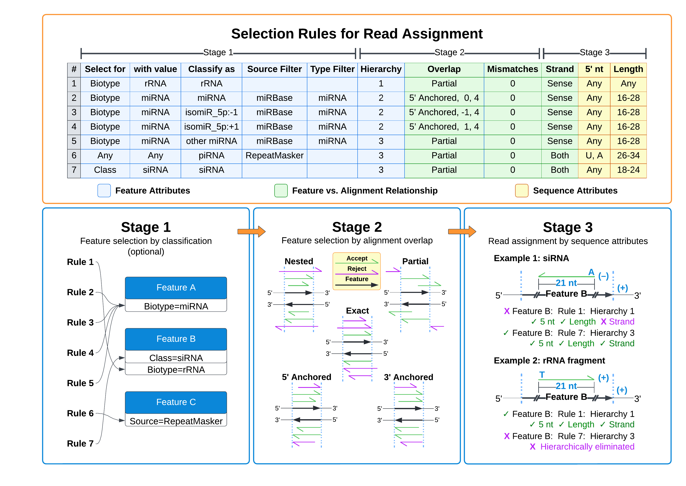
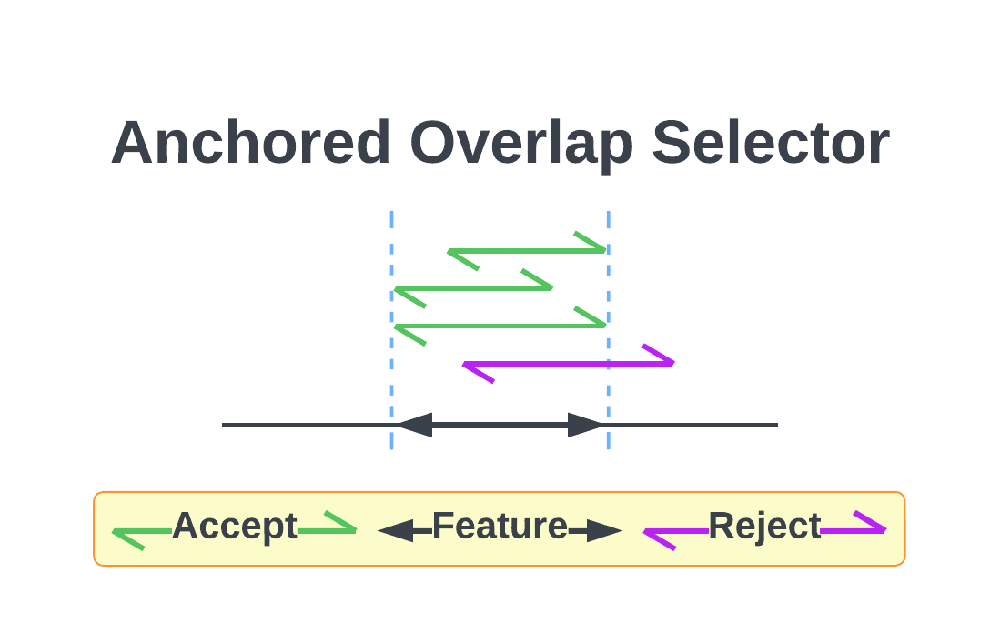

# Operation Details

## Parameters
For an explanation of tiny-count's parameters in the Run Config and by commandline, see [the parameters documentation](Parameters.md#tiny-count).

## Resuming an End-to-End Analysis
tiny-count offers a variety of options for refining your analysis. You might find that repeat analyses are required while tuning these options to your goals. Using the command `tiny recount`, tinyRNA will run the workflow starting at the tiny-count step using inputs from a prior end-to-end run to save time. See the [pipeline resume documentation](Pipeline.md#resuming-a-prior-analysis) for details and prerequisites.

## Running as a Standalone Tool
Skip to [Feature Selection](#feature-selection) if you are using the tinyRNA workflow.

If you would like to run tiny-count as a standalone tool, not as part of an end-to-end or resumed analysis, you can do so with the command `tiny-count`. The command has [one required argument](Parameters.md#full-tiny-count-help-string): your Paths File. Your Samples Sheet will need to list SAM or BAM alignment files rather than FASTQ files in the `Input Files` column. Alignment files from third party sources are also supported, and if they have been produced from reads collapsed by tiny-collapse or fastx, tiny-count will honor the reported read counts.

#### Input File Requirements
The SAM/BAM files provided during standalone runs _must_ be ordered so that multi-mapping read alignments are listed adjacent to one another. This adjacency convention is required for proper normalization by genomic hits. For this reason, files with ambiguous order will be rejected unless they were produced by an alignment tool that we recognize for following the adjacency convention. At this time, this includes Bowtie, Bowtie2, and STAR (an admittedly incomplete list).

#### BAM File Tips
- Use the `--no-PG` option with `samtools view` when converting alignments 
- Pysam will issue two warnings about missing index files; they can be ignored

#### Using Non-collapsed Sequence Alignments
While third-party SAM files from non-collapsed reads are supported, there are some caveats. These files will result in substantially higher resource usage and runtimes; we strongly recommend collapsing prior to alignment. Additionally, the sequence-related stats produced by tiny-count will no longer represent _unique_ sequences. These stats will instead refer to all sequences with unique QNAMEs (that is, multi-alignment bundles still cary a sequence count of 1).


# Feature Selection

We provide a [Features Sheet](Configuration.md#features-sheet-details) (`features.csv`) in which you can define selection rules to more accurately capture counts for the small RNAs of interest. The parameters for these rules include attributes commonly used in the classification of small RNAs, such as length, strandedness, and 5' nucleotide.

>**Important**: candidate features do not receive counts if they do not pass the selection process described below

Selection occurs in three stages, with the output of each stage as input to the next:
1. Features are matched to rules based on their attributes defined in GFF files
2. At each alignment locus, overlapping features are selected based on the overlap requirements of their matched rules. Selected features are sorted by hierarchy value so that smaller values take precedence in the next stage.
3. Finally, features are selected for read assignment based on the small RNA attributes of the alignment locus. Once reads are assigned to a feature, they are excluded from matches with larger hierarchy values.



## Sequence-Based Counting Mode
If GFF files aren't specified in your Paths File, Stage 1 selection is skipped and reads are counted by sequence rather than by feature. Reference sequence names and lengths are determined from the `@SQ` headers of input SAM files. In Stages 2 and 3, these reference sequences behave like features that had matched every rule in Stage 1. Selection takes place for both the sense and antisense copy of these sequences, and read counts are subset per-sequence if any `Classify as...` values are provided.
 
## Stage 1: Feature Attribute Parameters
| _Features Sheet Selectors:_ | Select for... | with value... | Classify as... | Source Filter | Type Filter |
|-----------------------------|---------------|---------------|----------------|---------------|-------------|

This stage deals with GFF parsing. Features are selected and classified based on their source, type, and attributes (GFF columns 2, 3, and 9) using the selectors listed above. If you do not have or wish to use GFF annotations for your experiment, [see sequence-based counting](#sequence-based-counting-mode).

Each feature's attributes (column 9) are searched for pairs matching each rule's `Select for...` and `with value...` selectors. Feature matches are then filtered based on the source (column 2) and type (column 3) requirements of their matching rules' `Source Filter` and `Type Filter` selectors.

#### Feature Classification
You can optionally specify a classifier for each rule using the `Classify as...` column. In tiny-count, the classifier is used to subset reads from individual features. If a feature matches multiple rules with different classifiers, then each classification of that feature is counted separately, per the matching rule, and will have its own entry in the output counts table. If the rules instead share the same classifier, then counts contributed from each rule are pooled under the same classification of that feature. Each subclassification of a feature is treated as a distinct "feature" during DGE analysis in tiny-deseq, and in tiny-plot the classifier is used to group and label counts in class-related plots.

#### Attribute Value Lists
Feature attributes (GFF column 9) with multiple comma separated values are treated as a list. Only one of the listed values needs to match the `with value...` selector for the feature to be considered a match to the rule. For example, if a rule has `Select for: Class` `with value: WAGO` in these columns, then a feature with attribute `Class=CSR,WAGO` would be considered a match for the rule.

## Stage 2: Overlap and Hierarchy Parameters
| _Features Sheet Selectors:_ | Hierarchy | Overlap |
|-----------------------------|-----------|---------|

Features overlapping a read alignment are selected based on their overlap characteristics. These matches are then sorted by hierarchy value before proceeding to Stage 3.

### Overlap
This column allows you to specify the extent of overlap required for candidate feature selection. In order to be a candidate, a feature must reside on the same chromosome as the alignment and overlap its interval by at least 1 nucleotide. A shared strand is not required. See the [Strand](#strand) section in Stage 3 for selection by strand.

#### Selector Demonstration

The following table provides a description and illustration of the available overlap selectors. All matches apply to features on either strand, i.e. matches shown below the antisense strand also apply, as shown, to the feature on the sense strand, and vice versa.

| Keyword and Description                                                                           |                                     Illustration                                      |
|:--------------------------------------------------------------------------------------------------|:-------------------------------------------------------------------------------------:|
| `partial`: alignment overlaps feature by at least one base                                        |          |
| `nested`: alignment does not extend beyond either terminus of the feature                         |            |
| `exact`: alignment termini are equal to the feature's                                             |              |
| `anchored`: alignment is nested with start and/or end equal to the feature's                      |        |
| `5' anchored`: alignment is nested with 5' end equal to the corresponding terminus of the feature |  |
| `3' anchored`: alignment is nested with 3' end equal to the corresponding terminus of the feature |  |

:people_holding_hands: Illustration colors have been selected for colorblindness accessibility.

#### Shift Parameters
An optional shift parameter can be provided for each overlap selector which changes the position of the 5' and/or 3' terminus of its feature matches. The shifted interval replaces the original for the given match, and its candidature and selection is based on this new interval. A feature matching both shifted and unshifted rules will retain its original interval for non-shifted matches.


The shift parameter can be specified as:
```
selector, M, N
  M = shift value for 5' end
  N = shift value for 3' end
```

- Positive values shift the specified end in the 3' direction
- Negative values shift the specified end in the 5' direction
- If either parameter is provided, the other must also be provided
- Zero is also an accepted shift value

#### Unstranded Features
 If these features match rules with `5' anchored` and `3' anchored` overlap selectors, they will be downgraded to `anchored` selectors. Alignments overlapping these features are evaluated for shared start and/or end coordinates, but 5' and 3' ends are not distinguished.

### Mismatches
The Mismatches column allows you to place constraints the edit distance, or the number of mismatches and indels, from the alignment to the reference. The Mismatch definition is explicit, i.e., a value of 3 means exactly 3, not 3 or less. Definitions support ranges (e.g., 0-3), lists (e.g., 1, 3), wildcards, and single values. This functionality can be extended to require a [specific edit pattern](Parameters.md#mismatch-pattern).

#### Edit Distance Determination
An alignment's edit distance is determined from its NM tag. Currently, alignments that lack an NM tag are treated as an error.

### Hierarchy
Each rule must be assigned a hierarchy value. This value is used to sort Stage 2 matches so that matches with smaller hierarchy values take precedence in Stage 3.
- Each feature can have multiple hierarchy values if it matched more than one rule during Stage 1 selection
- Multiple rules are allowed to share the same value

>**Important:**
Let's take a step back. What exactly is the product of selection here? Not just a feature, but a feature _and_ a rule it had matched during Stage 1 selection. This is an important distinction because in Stage 3, only the **selected rule(s)** will be used to determine if the corresponding feature is an appropriate assignment based on the alignment's attributes.

You can use larger hierarchy values to exclude features that are not of interest.

>**Example:** suppose you have a miRNA locus embedded within a coding gene locus (within an intron for example). By assigning a hierarchy of 1 to miRNA and a hierarchy of 2 to coding genes, all small RNA counts from sequences matching to the miRNA would be excluded from total counts for the coding gene. Reversing the hierarchy such that miRNA had a hierarchy of 2 and coding genes had a hierarchy of 1 would instead exclude reads from sequences matching to the coding gene from total counts for the miRNA. If a hierarchy of 1 was assigned to both miRNAs and coding genes, counts for sequences matching both features would be split between them.

## Stage 3: Alignment Attribute Parameters
| _Features Sheet Selectors:_ | Strand | 5' End Nucleotide | Length |
|-----------------------------|--------|-------------------|--------|

The final stage of selection is concerned with the small RNA attributes of each alignment locus. Candidates are evaluated in order of hierarchy value where smaller values take precedence. Once a match has been found, reads are excluded from remaining candidates with larger hierarchy values.

### Strand
This selector defines requirements for the alignment's strand relative to the feature's strand. Here, sense and antisense don't refer to the feature's or alignment's strand alone, but rather whether the alignment is sense/antisense to the feature.
- `sense`: the alignment strand must match the feature's strand for a match
- `antisense`: the alignment strand must not match the feature's strand for a match
- `both`: strand is not evaluated

#### Unstranded Features
These features will match all strand selectors regardless of the alignment's strand.


### 5' End Nucleotide and Length
| Selector | Wildcard | Single | List | Range |
|---------:|:--------:|:------:|:----:|:-----:|
|    5' nt |    ✓     |   ✓    |  ✓   |       |
|   Length |    ✓     |   ✓    |  ✓   |   ✓   |

Examples:
- **Wildcard**: `any`, `all`, `*`, or a blank cell
- **Single**: `G` or `22`
- **List**: `C,G,U` or `25, 26` (spaces do not matter)
- **Range**: `20-25`
- **Mixed** <sup>†</sup>: `19, 21-23, 25-30` 

<sup>†</sup> only supported by the `Length` selector

>**Tip:** you may specify U and T bases in your rules. Uracil bases will be converted to thymine when your Features Sheet is loaded. N bases are also allowed.

## Count Normalization
Small RNA reads passing selection will receive a normalized count increment. By default, read counts are normalized twice before being assigned to a feature. Both normalization steps can be disabled in `run_config.yml` if desired. Counts for each small RNA sequence are divided: 
1. By the number of loci it aligns to in the genome (genomic hits).
2. By the number of _selected_ features for each of its alignments (feature hits).

>**Important**: For proper normalization by genomic hits, input files must be ordered such that multi-mapping read alignments are listed adjacent to one another. 

## The Details
You may encounter the following cases when you have more than one unique GFF file listed in your Paths File:
- If a feature is defined in one GFF file, then again in another but with differing attributes, rule and alias matches will be merged for the feature
- If a feature is defined in one GFF file, then again but with a different `alias` parameter, then all unique aliases are retained for the feature and listed in its `Feature Name` column.

Discontinuous features and feature filtering support:
- Discontinuous features are supported (as defined by the `Parent` attribute key, or by a shared `ID`/`gene_id` attribute value). Rule and alias matches of descendents are merged with the root parent's.
- If a feature contains both `ID` and `gene_id` attributes, only the value of `ID` is used as the feature's ID.
- If a filtered feature breaks a feature lineage (that is, features chained via the `Parent` attribute), then the highest non-filtered ancestor is designated the root parent. The lineage is maintained transparently but the filtered feature does not contribute to the domains of selection. A feature is considered "filtered" when it fails to match a rule's `Source Filter` **and** `Type Filter`