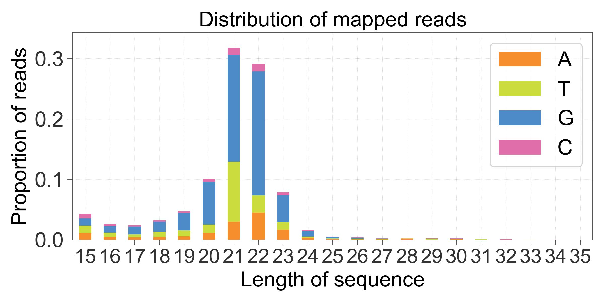
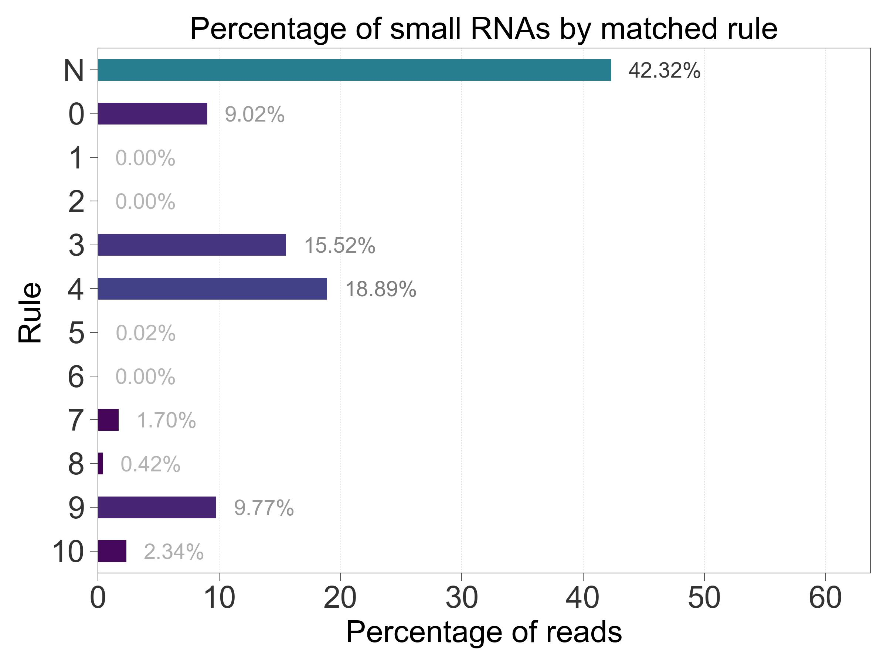

# Operation Details

## Parameters
For an explanation of tiny-plot's parameters in the Run Config and by commandline, see [the parameters documentation](Parameters.md#tiny-plot).

## Input Files
tinyRNA automatically handles file inputs when tiny-plot is called as a step in a [pipeline run](Pipeline.md). It is necessary to identify these files when running tiny-plot as a standalone step. The list of possible input files is lengthy, so you are free to specify only the subset of inputs that are required for your desired plot types. The dependencies per plot type are as follows:

| Plot Type                       | Input File Commandline Argument(s)                         | Source                        |
|---------------------------------|------------------------------------------------------------|-------------------------------|
| len_dist                        | `--len-dist FILE FILE FILE ...`                            | tiny-count                    |
| rule_charts                     | `--rule-counts FILE`                                       | tiny-count                    |
| class_charts                    | `--raw-counts FILE` `--summary-stats FILE`             | tiny-count tiny-count     |
| replicate_scatter               | `--norm-counts FILE`                                       | tiny-deseq.r                  |
| sample_avg_scatter_by_dge       | `--norm-counts FILE` `--dge-tables FILE FILE FILE ...` | tiny-deseq.r tiny-deseq.r |
| sample_avg_scatter_by_dge_class | `--norm-counts FILE` `--dge-tables FILE FILE FILE ...` | tiny-deseq.r tiny-deseq.r |

# Plot Types

## len_dist
The distributions of 5' end nucleotides vs. sequence lengths can be used to assess the overall quality of your libraries. This can also be used for analyzing small RNA distributions in non-model organisms without annotations.

    

#### Subtypes
Two plots are produced for each replicate:
- Distribution of _Mapped Reads_, which are counted for every alignment reported in tiny-count's input SAM files
- Distribution of _Assigned Reads_, which are counted at each alignment where at least one overlapping feature passed selection and was assigned a portion of the sequence's original counts

#### Length Bounds
Lengths are plotted over a continuous range, even if an intermediate length was not observed, and the bounds of this range can be assigned automatically or manually. Manual lengths can be assigned using [plot_len_dist_min and plot_len_dist_max](Parameters.md#bounds-for-len_dist-charts).

When tiny-plot is called as a step in a pipeline run, min and max bounds are determined independently in the following order of priority:
1. Manual assignment in the Run Config
2. From the corresponding _optional_ entries for fastp (`length_required` and `length_limit`) in the Run Config
3. Automatic assignment from the data. Bounds are determined by considering the min/max lengths across all libraries such that all plots have the same bounds. This determination is performed separately for each plot subtype.

When tiny-plot is called as a standalone step, orders 1 and 3 are used. Manual assignment is performed via the equivalent commandline arguments in order 1.

#### Non-Nucleotide Bases
Placeholder bases, e.g. N, will be reported if they are encountered at the 5' end. Otherwise only the 4 standard bases are reported.

## rule_charts
Counts are assigned only to the features that meet selection criteria at each alignment locus. It is useful to see how each selection rule contributed to the overall assignment of counts. The rule_charts plot type shows the percentage of _mapped reads_ that each rule contributed to the total _assigned reads_.

    

#### Rule Number
Rules are referred to by their row number in the Features Sheet and the first non-header row is considered rule 0. Rule **N** represents the percentage of mapped reads that were unassigned. Sources of unassigned reads include:
- A lack of features passing selection at alignment loci
- Alignments which do not overlap with any features

#### Rule Chart Styles
Percentage label darkness and bar colors reflect the magnitude of the rule's contribution. Magnitude is always considered on a 0-100% scale, rather than scaling down to the chart's view limits. These styles cannot be changed using a plot stylesheet.

## class_charts
Features can have multiple classes associated with them, so it is useful to see the proportions of counts by class. The class_charts plot type shows the percentage of _mapped_ reads that were assigned to features by class. Each feature's associated classes are determined by the rules that it matched during Stage 1 selection, and is therefore determined by its GFF annotations.

    

#### Class \_UNASSIGNED_
This category represents the percentage of mapped reads that weren't assigned to any features. Sources of unassigned reads include:
- A lack of features passing selection at alignment loci
- Alignments which do not overlap with any features

You can customize this label using the [unassigned class parameter.](Parameters.md#labels-for-class-related-plots)

#### Class \_UNKNOWN_
This category represents the percentage of mapped reads that matched rules which did not have a specified `Classify as...` value. You can customize this label using the [unknown class parameter.](Parameters.md#labels-for-class-related-plots)

#### Class Chart Styles
Proportions in rule_charts and class_charts are plotted using the same function. Styles are the same between the two. See [rule chart styles](#rule-chart-styles) for more info.

## replicate_scatter
Feature count comparisons between replicates can be used to assess the overall quality of your libraries. The replicate_scatter plot type shows these comparisons using DESeq2's normalized counts on Log2 scale axes. A plot is produced for all replicate combinations in each sample group.

    

## sample_avg_scatter_by_dge
Differential gene expression between sample groups can be visualized with this plot type. Normalized feature counts from DESeq2 are averaged across replicates for each sample and plotted on Log2 scale axes. Features with significant expression levels will have their counts plotted with red points.

    

#### Customization
The P value cutoff can be changed using the [Run Config or commandline arguments](Parameters.md#p-value). The control condition is plotted on the x-axis, but it must be specified in your Samples Sheet prior to running an end-to-end or `tiny recount` analysis. If using `tiny replot`, is not possible to change a no-control experiment to a control experiment and have these changes reflected in these plots. This is because tiny-deseq.r must be aware of the control condition in order to perform the proper directional comparisons.

## sample_avg_scatter_by_dge_class
The previous plot type can be extended to group and color differentially expressed features by class. Classes are sorted by abundance before plotting to maximize representation.

    

>**Tip**: if you find that two groups of interest share proximity and are too similar in color, you can change the group's color with a modified Plot Stylesheet. The groups will be colored in the same order they are listed in the legend (not including P value outgroup), e.g. changing the color of the ERGO group means changing the 5th color in the `axes.prop_cycle` color cycler. See the [config file documentation](Configuration.md#plot-stylesheet-details) for more info about the Plot Stylesheet.